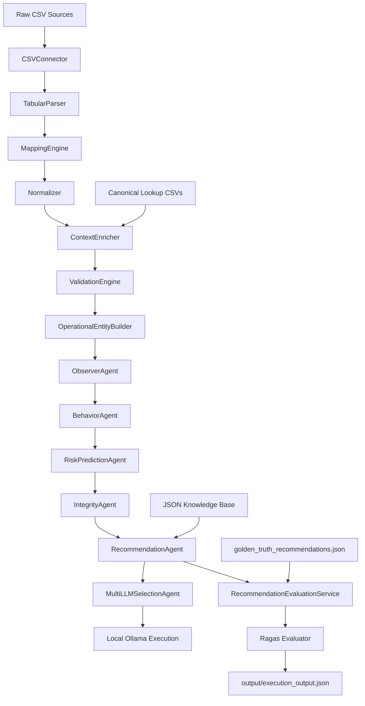
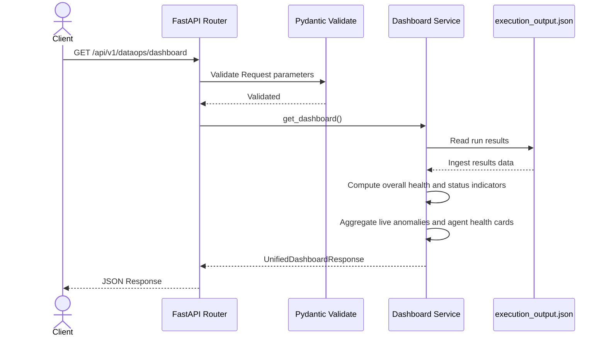
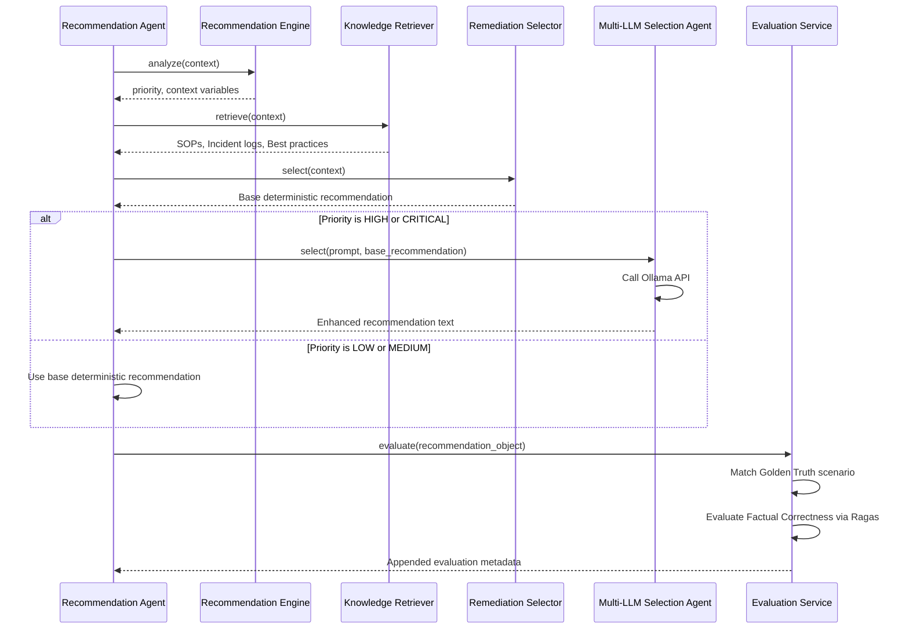

# Data Pipeline Operations Intelligence
## Backend Implementation Documentation

This document describes the complete backend implementation of the **Data Pipeline Operations Intelligence** platform (AIF - Adaptive Intelligence Fabric) from a developer's perspective. It accurately reflects the codebase, modules, classes, and logic present in the repository, without making any assumptions or introducing external designs.

---

## 1. Project Overview

### Purpose of the Project
The **Data Pipeline Operations Intelligence** system is an operations intelligence backend that ingests, parses, normalizes, validates, enriches, analyzes, and formulates response recommendations for multi-platform data pipeline executions (Airflow, Kafka, Kubernetes, Azure Data Factory, SAP ERP, Manufacturing, and IoT). The system monitors executions for anomalies, evaluates risks (probability and category), verifies output data integrity, and suggests remediations. These recommendations are generated deterministically via local rules and enhanced dynamically via a cascaded Multi-LLM setup. Recommendations are also evaluated objectively using the Ragas framework.

### Overall Architecture
The system follows a layered architecture, starting from raw ingestion to downstream evaluation:
1. **Capability Adapter Layer**: Connects to CSV sources, parses data, maps source schemas to a canonical data model, normalizes values, enriches with historical/business context, and runs initial schema/numeric validations to package them into canonical **Operational Entities**.
2. **Observer Agent Layer**: Analyzes execution states, baseline deviations, trends, and event correlations.
3. **Behavior Agent Layer**: Determines metric-level deviations, tracks rolling execution drift, identifies widespread or isolated anomaly patterns, and calculates a behavior score and confidence.
4. **Risk Prediction Agent Layer**: Extracts operational features, normalizes them using domain-specific profiles, calculates a weighted risk score, categorizes the risk type (Pipeline Failure, SLA Breach, Resource Exhaustion, Dependency Failure, Data Quality Risk, Infrastructure Risk, Configuration Risk, or Operational Risk), calculates probability using a logistic sigmoid, and computes prediction confidence.
5. **Integrity Agent Layer**: Assesses data quality, schema compliance, business rule validation, and lineage completeness, yielding an Integrity Score and Output Trust Level.
6. **Recommendation Agent Layer**: Merges context to compute priority. First, it determines a base recommendation and impact/recovery estimation deterministically. Then, it cascades to a **Multi-LLM Selection Agent** to dynamically enhance recommendations for High and Critical pipelines using local Ollama instances (with fallback to deterministic outputs on outage or validation failure).
7. **Recommendation Evaluation Layer**: Triggers the **Recommendation Evaluation Service** to resolve Golden Truth scenarios, performs factual correctness scoring via **Ragas** (using Ollama as the evaluator backend), and appends evaluation metadata to the final output.
8. **API REST Layer**: Serves frontend dashboards and copilot clients with unified status, execution history, lineage, details, recommendations, copilot chat interfaces, and agent health diagnostics.

```
[ Raw CSV Files ] ──(CSVConnector)──> [ TabularParser ]
                                             │
                                      (MappingEngine)
                                             │
                                       (Normalizer)
                                             │
                                     (ContextEnricher) <── [ Canonical CSV Files ]
                                             │
                                     (ValidationEngine)
                                             │
                                 (OperationalEntityBuilder)
                                             │
                                             ▼
                                     [ ObserverAgent ]
                                             │
                                             ▼
                                     [ BehaviorAgent ]
                                             │
                                             ▼
                                   [ RiskPredictionAgent ]
                                             │
                                             ▼
                                     [ IntegrityAgent ]
                                             │
                                             ▼
                                   [ RecommendationAgent ] <── [ Knowledge Retrieval (JSON) ]
                                             │
                                  (MultiLLMSelectionAgent)
                                             │
                                    (RagasEvaluator) <── [ Golden Truth Scenarios ]
                                             │
                                             ▼
                                [ output/execution_output.json ]
```

### Technology Stack
* **Programming Language**: Python 3
* **Backend Framework**: FastAPI (with Uvicorn runner)
* **Data Processing Libraries**: Pandas, NumPy, OpenPyXL
* **Configuration & Logging**: PyYAML, Loguru
* **LLM Integration & Clients**: Google Generative AI SDK, Requests (for Groq and local Ollama REST endpoints), LangChain (`langchain_community.chat_models.ChatOllama` for evaluation)
* **AI/ML & LLM Evaluation**: RAGAS (for factual correctness evaluation)
* **Environment Configuration**: python-dotenv

### Data Sources
* **Raw Execution Datasets**: Airflow runs, Kafka metrics, Kubernetes pods, Azure Data Factory runs, SAP batch jobs, manufacturing event cycles, IoT sensor reports.
* **Canonical Context Metadata**: Business context (criticality, owner, SLA constraints), historical baseline statistics (runtime, CPU, memory, throughput averages), incident history logs, pipeline lineage dependencies, and recommendation outcome history.

### API Architecture
The API is exposed via FastAPI routes, organized under the prefix `/api/v1/dataops` for main analytics and `/pipeline` for execution triggering. It returns structured JSON responses matching Pydantic response models defined in `api/schemas/response.py`.

---

## 2. Project Folder Structure

```
c:\Users\Asus\OneDrive\Documents\Desktop\Data-Pipeline-Operations-Intelligence\
├── adapters/
│   ├── connectors/          # Raw data connectors (CSV loading)
│   ├── parsers/             # Tabular data parsers (NaN/strip handling)
│   ├── mapping/             # Target schema field mappings to CDM
│   ├── normalizer/          # Datetime, status, and value normalizers
│   ├── enricher/            # Joins lookup contexts (baselines, business context)
│   ├── validation/          # Performs datatype, range, and duplicates verification
│   └── entity_builder/      # Wraps validated records in CDM format
├── agents/
│   ├── base/                # Base interfaces for agents and schemas (empty placeholders)
│   ├── behavior/            # Baseline deviations, pattern detection, and drift analysis
│   ├── risk/                # Feature extraction, scoring, category classification, and sigmoid probability
│   ├── integrity/           # Data quality, schema, lineage, and business rules validation
│   ├── recommendation/      # Orchestrates remediation generation and RAGAS evaluation
│   │   ├── evaluation/      # Resolves Golden Truth scenarios and calls RAGAS
│   │   └── knowledge/       # Local incident playbooks, SOPs, and platform best practices
│   └── multi_llm_selection/ # Cascading LLM clients (Gemini, Groq, Ollama) and response parser
├── api/
│   ├── routes/              # FastAPI endpoints (health, pipeline execution, unified dashboard, details)
│   ├── schemas/             # Pydantic request and response models
│   └── services/            # Route business logic execution (Dashboard, Pipeline, Recommendation, Copilot)
├── config/                  # Configuration YAMLs, rules configs, and LLM prompt templates
├── data/
│   ├── canonical/           # Canonical lookup datasets (historical_baselines, lineage, business_context)
│   ├── evaluation/          # Golden Truth validation dataset
│   └── raw_sources/         # Raw source execution CSV files
├── output/                  # JSON files containing outputs from pipeline executions
├── services/                # Empty root-level service skeletons (audit, memory, notification)
└── workflows/               # Orchestration workflow scripts (main pipeline execution flow)
```

---

## 3. File-by-File Documentation

### API Module

#### 1. [main.py](file:///c:/Users/Asus/OneDrive/Documents/Desktop/Data-Pipeline-Operations-Intelligence/api/main.py)
* **Purpose**: Application entry point initializing the FastAPI app.
* **Classes**: None
* **Functions**: None (Instantiates `app = FastAPI(...)`)
* **Responsibilities**: Configures app metadata (title, version) and includes API routers for health, pipeline, and dataops paths.
* **Dependencies**: `fastapi`, `api.routes.health`, `api.routes.pipeline`, `api.routes.dataops`.
* **Who calls this file**: Uvicorn server runner.
* **Which files use this file**: None.

#### 2. [health.py](file:///c:/Users/Asus/OneDrive/Documents/Desktop/Data-Pipeline-Operations-Intelligence/api/routes/health.py)
* **Purpose**: Exposes simple application diagnostic health check route.
* **Classes**: None
* **Functions**: `health_check()`
* **Responsibilities**: Returns JSON object checking API status.
* **Dependencies**: `fastapi.APIRouter`.
* **Who calls this file**: Registered inside `api/main.py`.
* **Which files use this file**: None.

#### 3. [pipeline.py](file:///c:/Users/Asus/OneDrive/Documents/Desktop/Data-Pipeline-Operations-Intelligence/api/routes/pipeline.py)
* **Purpose**: Legacy routing file for pipeline execution.
* **Classes**: None
* **Functions**: `execute_pipeline()`
* **Responsibilities**: Exposes `/pipeline/execute` endpoint mapping to `PipelineService.execute()`.
* **Dependencies**: `fastapi.APIRouter`, `api.services.pipeline_service.PipelineService`.
* **Who calls this file**: Registered inside `api/main.py`.
* **Which files use this file**: None.

#### 4. [dataops.py](file:///c:/Users/Asus/OneDrive/Documents/Desktop/Data-Pipeline-Operations-Intelligence/api/routes/dataops.py)
* **Purpose**: Core API controller defining REST endpoints for operations intelligence.
* **Classes**: None
* **Functions**:
  * `execute_pipeline()`: Triggers execution flow via `PipelineService.execute()`.
  * `get_dashboard()`: Returns aggregated unified dashboard summary via `DashboardService.get_dashboard()`.
  * `get_pipeline(pipelineId)`: Fetches details across all AIF stages for a pipeline via `PipelineDetailsService.get_pipeline()`.
  * `get_pipeline_timeline(pipelineId)`: Fetches timeline historical events via `PipelineDetailsService.get_pipeline_timeline()`.
  * `get_pipeline_dependencies(pipelineId)`: Fetches dependency lineage details via `PipelineDetailsService.get_pipeline_dependencies()`.
  * `get_recommendation(pipelineId)`: Fetches pipeline remediation details via `RecommendationService.get_recommendation()`.
  * `copilot_chat(payload)`: Receives user queries, mapping to `CopilotService.chat()`.
  * `get_agents()`: Returns list of intelligence agents and health status via `AgentService.get_agents()`.
* **Responsibilities**: Route endpoint definitions, query parameter validation, routing to respective services, and response serialization matching Pydantic response models.
* **Dependencies**: `fastapi.APIRouter`, Pydantic models from `api.schemas.response`, services from `api.services`.
* **Who calls this file**: FastAPI request router.
* **Which files use this file**: None.

#### 5. [request.py](file:///c:/Users/Asus/OneDrive/Documents/Desktop/Data-Pipeline-Operations-Intelligence/api/schemas/request.py)
* **Purpose**: Defines request validation models.
* **Classes**:
  * `CopilotQuery(BaseModel)`: Validation schema for copilot user inputs (`useCaseId`, `domainId`, `question`, `context`).
* **Functions**: None
* **Responsibilities**: Pydantic input sanitization and verification.
* **Dependencies**: `pydantic.BaseModel`.
* **Who calls this file**: Imported by `api/routes/dataops.py`.
* **Which files use this file**: None.

#### 6. [response.py](file:///c:/Users/Asus/OneDrive/Documents/Desktop/Data-Pipeline-Operations-Intelligence/api/schemas/response.py)
* **Purpose**: Defines response models for AIF API serialization.
* **Classes**:
  * `PipelineDetailsResponse`, `TimelineEvent`, `TimelineResponse`, `LineageRelation`, `DependencyResponse`, `RecommendationResponse`, `CopilotChatResponse`, `AgentHealthDetail`, `AgentsResponse`, `DashboardSummaryResponse`, `UnifiedSummary`, `UnifiedHealthNode`, `UnifiedHealth`, `UnifiedAnomaly`, `UnifiedAgent`, `UnifiedRiskSummary`, `CopilotContext`, `UnifiedDashboardResponse`.
* **Functions**: None
* **Responsibilities**: Explicit output definitions ensuring contract compatibility with frontend clients.
* **Dependencies**: `pydantic.BaseModel`, `typing`.
* **Who calls this file**: Imported by `api/routes/dataops.py` and `api/services/dashboard_service.py`.
* **Which files use this file**: None.

#### 7. [pipeline_service.py](file:///c:/Users/Asus/OneDrive/Documents/Desktop/Data-Pipeline-Operations-Intelligence/api/services/pipeline_service.py)
* **Purpose**: Implements execution triggers.
* **Classes**: `PipelineService`
* **Functions**:
  * `execute()`: Static method running `workflows.main.main()`, measuring execution duration, saving results, and writing `output/execution_metadata.json`.
* **Responsibilities**: File orchestration execution, telemetry collection (duration, success/failure), and file logging.
* **Dependencies**: `workflows.main`, `json`, `os`, `time`.
* **Who calls this file**: `api/routes/pipeline.py` and `api/routes/dataops.py`.
* **Which files use this file**: None.

#### 8. [dashboard_service.py](file:///c:/Users/Asus/OneDrive/Documents/Desktop/Data-Pipeline-Operations-Intelligence/api/services/dashboard_service.py)
* **Purpose**: Compiles unified analytics, risk summaries, anomalies feed, and agent health cards.
* **Classes**: `DashboardService`
* **Functions**:
  * `_load_json_file(path)`: Safely loads local output files.
  * `get_summary()`: Formulates standard diagnostic statistics, counts, and top critical items.
  * `get_dashboard()`: Compiles unified responsive dashboards, dynamically computing health node scores, overall health index, active anomalies, risk cascades, and copilot contexts from the latest run.
* **Responsibilities**: Processes execution output, averages dynamic indicators, and outputs serialized unified responses.
* **Dependencies**: `api.services.agent_service.AgentService`, `api.services.pipeline_details_service.PipelineDetailsService`, `api.schemas.response.UnifiedDashboardResponse`.
* **Who calls this file**: `api/routes/dataops.py`.
* **Which files use this file**: None.

#### 9. [pipeline_details_service.py](file:///c:/Users/Asus/OneDrive/Documents/Desktop/Data-Pipeline-Operations-Intelligence/api/services/pipeline_details_service.py)
* **Purpose**: Fetches state details, execution timeline logs, and lineage diagrams for a given pipeline run ID.
* **Classes**: `PipelineDetailsService`
* **Functions**:
  * `_load_execution_output()`: Reads `output/execution_output.json`.
  * `get_pipeline(pipeline_id)`: Extracts the Operational Entity, Observation Object, Behavior Object, Risk Object, Integrity Object, and Recommendation Object for the requested `pipeline_id`.
  * `get_pipeline_timeline(pipeline_id)`: Fetches matching entity logs or generates a mock timeline history relative to the execution timestamp.
  * `get_pipeline_dependencies(pipeline_id)`: Ingests `pipeline_lineage.csv` using Pandas, mapping upstream and downstream pipeline associations.
* **Responsibilities**: Lineage extraction, object resolution, and timeline formatting.
* **Dependencies**: `json`, `os`, `pandas`, `datetime`.
* **Who calls this file**: `api/routes/dataops.py` and `api/services/dashboard_service.py`.
* **Which files use this file**: None.

#### 10. [copilot_service.py](file:///c:/Users/Asus/OneDrive/Documents/Desktop/Data-Pipeline-Operations-Intelligence/api/services/copilot_service.py)
* **Purpose**: Simulates conversational responses.
* **Classes**: `CopilotService`
* **Functions**:
  * `chat(question)`: Performs simple keyword queries (looks up "bro0001" to output pre-formulated explanations, diagnostics, and suggested follow-ups; falls back to default responses otherwise).
* **Responsibilities**: **Mock Implementation**. It does not perform actual LLM generation or context retrieval for copilot chat. It uses hardcoded responses.
* **Dependencies**: `typing`.
* **Who calls this file**: `api/routes/dataops.py`.
* **Which files use this file**: None.

#### 11. [agent_service.py](file:///c:/Users/Asus/OneDrive/Documents/Desktop/Data-Pipeline-Operations-Intelligence/api/services/agent_service.py)
* **Purpose**: Lists registered service agents.
* **Classes**: `AgentService`
* **Functions**:
  * `get_agents()`: Returns health status, version parameters, and diagnostic indicators for Capability Adapter, Observer, Behavior, Risk Prediction, Integrity, Recommendation, and Multi LLM.
* **Responsibilities**: **Mock Implementation**. Returns static diagnostic lists.
* **Dependencies**: `typing`.
* **Who calls this file**: `api/routes/dataops.py` and `api/services/dashboard_service.py`.
* **Which files use this file**: None.

#### 12. [recommendation_service.py](file:///c:/Users/Asus/OneDrive/Documents/Desktop/Data-Pipeline-Operations-Intelligence/api/services/recommendation_service.py)
* **Purpose**: Fetches recommendation results.
* **Classes**: `RecommendationService`
* **Functions**:
  * `get_recommendation(pipeline_id)`: Resolves recommendation items for the requested pipeline and formats them into a clean dictionary.
* **Responsibilities**: Resolves LLM model names, generation sources, priority details, and automation flags.
* **Dependencies**: `json`, `os`.
* **Who calls this file**: `api/routes/dataops.py`.
* **Which files use this file**: None.

---

### Capability Adapter Layer

#### 13. [csv_connector.py](file:///c:/Users/Asus/OneDrive/Documents/Desktop/Data-Pipeline-Operations-Intelligence/adapters/connectors/csv_connector.py)
* **Purpose**: Handles CSV loading and connection tracking.
* **Classes**: `CSVConnector`
* **Functions**:
  * `__init__(config_path)`: Configures connector targets.
  * `load_config()`: Safe-loads sources path mappings from configuration YAML.
  * `connect()`: Initializes loading.
  * `disconnect()`: Drops loading state.
  * `validate_file(file_path)`: Checks file existence and size.
  * `read(source_name)`: Loads a single CSV using Pandas.
  * `read_all()`: Returns a dictionary of loaded DataFrames.
  * `health_check()`: Verifies source files are present and readable.
* **Responsibilities**: Loading CSV files and connection validation. It does not handle parsing, mapping, or normalizations.
* **Dependencies**: `os`, `time`, `yaml`, `pandas`.
* **Who calls this file**: `workflows/main.py`.
* **Which files use this file**: None.

#### 14. [tabular_parser.py](file:///c:/Users/Asus/OneDrive/Documents/Desktop/Data-Pipeline-Operations-Intelligence/adapters/parsers/tabular_parser.py)
* **Purpose**: Converts Pandas DataFrames to structured lists of records.
* **Classes**: `TabularParser`
* **Functions**:
  * `health_check(dataframe)`: Confirms inputs are non-empty DataFrames with unique columns.
  * `parse(dataset_name, dataframe)`: Strips whitespace from string elements, maps Pandas NaN to Python `None`, and formats output lists.
  * `parse_all(datasets)`: Batches parsing across all loaded tables.
* **Responsibilities**: Data format conversion and cell normalization. It does not map fields or normalize business rules.
* **Dependencies**: `pandas`, `logging`.
* **Who calls this file**: `workflows/main.py`.
* **Which files use this file**: None.

#### 15. [mapping_engine.py](file:///c:/Users/Asus/OneDrive/Documents/Desktop/Data-Pipeline-Operations-Intelligence/adapters/mapping/mapping_engine.py)
* **Purpose**: Translates source schemas to CDM keys.
* **Classes**: `MappingEngine`
* **Functions**:
  * `__init__(mapping_file)`: Instantiates the engine and loads mapping rules.
  * `load_mapping()`: Ingests `mapping.yaml` profiles.
  * `get_profile(dataset_name)`: Checks profile registration.
  * `map_record(record, profile)`: Transforms keys based on mappings, defaults, and constant values.
  * `map_dataset(dataset_name, records)`: Transforms list elements.
  * `map_all(parsed_datasets)`: Ingests all parsed raw sources.
* **Responsibilities**: Schema translation and fallback resolution. It does not enrich or validate values.
* **Dependencies**: `yaml`, `logging`.
* **Who calls this file**: `workflows/main.py`.
* **Which files use this file**: None.

#### 16. [normalizer.py](file:///c:/Users/Asus/OneDrive/Documents/Desktop/Data-Pipeline-Operations-Intelligence/adapters/normalizer/normalizer.py)
* **Purpose**: Standardizes execution statuses, numeric scales, and dates.
* **Classes**: `Normalizer`
* **Functions**:
  * `normalize_status(status)`: Maps source states to CDM states (`SUCCESS`, `FAILED`, `RUNNING`, `QUEUED`, `PENDING`).
  * `normalize_timestamp(value)`: Resolves date formats (`%Y-%m-%dT%H:%M:%S`, `%Y-%m-%d %H:%M:%S`, `%d-%m-%Y %H:%M:%S`) to ISO format.
  * `normalize_string(value)`: Strips and casts to string.
  * `normalize_number(value)`: Rounds floats to 2 decimal places.
  * `normalize_record(record)`: Maps record attributes.
  * `normalize_dataset(dataset_name, records)`: Runs dataset-level normalization.
  * `normalize_all(mapped_data)`: Integrates normalization across the mapped data.
* **Responsibilities**: Formats strings, dates, numbers, and states. It does not enrich context or run validations.
* **Dependencies**: `datetime`, `logging`.
* **Who calls this file**: `workflows/main.py`.
* **Which files use this file**: None.

#### 17. [context_enricher.py](file:///c:/Users/Asus/OneDrive/Documents/Desktop/Data-Pipeline-Operations-Intelligence/adapters/enricher/context_enricher.py)
* **Purpose**: Joins context lookup tables (business context, history, incidents, lineage, recommendations) on `entity_id`.
* **Classes**: `ContextEnricher`
* **Functions**:
  * `__init__(lookup_datasets)`: Loads lookup datasets.
  * `build_indexes()`: Maps lookup lists into fast-lookup hash maps indexed by `entity_id`.
  * `create_index(dataset)`: Standardizes `entity_id` mapping.
  * `enrich_business_context(record)`, `enrich_historical_context(record)`, `enrich_incident_context(record)`, `enrich_lineage_context(record)`, `enrich_recommendation_context(record)`: Associates context attributes with the target record.
  * `enrich_record(record)`: Performs record-level joins.
  * `enrich_dataset(dataset_name, records)`: Processes dataset records.
  * `enrich_all(normalized_data)`: Runs enrichment across normalized sources.
  * `health_check()`: Verifies index metrics.
* **Responsibilities**: Ingests lookup metadata and joins datasets on `entity_id`.
* **Dependencies**: `logging`.
* **Who calls this file**: `workflows/main.py`.
* **Which files use this file**: None.

#### 18. [validation_engine.py](file:///c:/Users/Asus/OneDrive/Documents/Desktop/Data-Pipeline-Operations-Intelligence/adapters/validation/validation_engine.py)
* **Purpose**: Performs datatype checking, range validation, and duplicate detection.
* **Classes**: `ValidationEngine`
* **Functions**:
  * `health_check()`: Diagnostic checks for active rules.
  * `validate_required_fields(record)`: Asserts presence of required fields (`entity_id`, `entity_name`, `entity_type`, `source_system`, `execution_status`, `event_timestamp`).
  * `validate_datatypes(record)`: Validates attributes against expected Python types.
  * `validate_status(record)`: Asserts status fits within approved statuses.
  * `validate_timestamp(record)`: Verifies timestamps are valid ISO formats.
  * `validate_ranges(record)`: Compares numeric parameters to allowed limits (CPU, memory, retry count, temperatures, throughput, runtimes).
  * `validate_business_rules(record)`: Asserts non-negative values for elapsed runtime, retries, and throughput.
  * `validate_context(record)`: Logs warnings for missing metadata contexts.
  * `validate_duplicate(record)`: Checks for duplicate `entity_id` occurrences using an in-memory set.
  * `calculate_score(errors, warnings)`: Computes a quality score from 100, subtracting 10 per error and 2 per warning.
  * `validate_record(record)`: Validates a single record and attaches status attributes (`validation_score`, `errors`, `warnings`, `is_valid`).
  * `validate_dataset(dataset_name, records)`: Processes dataset records.
  * `validate_all(enriched_data)`: Runs validation across enriched sources.
* **Responsibilities**: Quality checks, schema validation, and value constraint verification.
* **Dependencies**: `datetime`, `logging`.
* **Who calls this file**: `workflows/main.py`.
* **Which files use this file**: None.

#### 19. [operational_entity_builder.py](file:///c:/Users/Asus/OneDrive/Documents/Desktop/Data-Pipeline-Operations-Intelligence/adapters/entity_builder/operational_entity_builder.py)
* **Purpose**: Wraps records in a standard metadata format.
* **Classes**: `OperationalEntityBuilder`
* **Functions**:
  * `build_metadata()`: Attaches generator timestamps and version labels.
  * `build_validation(record)`: Formats the validation block.
  * `build_context(record)`: Packages enrichment parameters.
  * `build_entity(record)`: Translates record parameters to a structured Operational Entity dictionary.
  * `build_dataset(dataset_name, records)`: Processes dataset records.
  * `build_all(validated_data)`: Processes all validated datasets.
* **Responsibilities**: Packages the final Operational Entity dictionary structure.
* **Dependencies**: `datetime`, `logging`.
* **Who calls this file**: `workflows/main.py`.
* **Which files use this file**: None.

---

### Observer Agent

#### 20. [observer_agent.py](file:///c:/Users/Asus/OneDrive/Documents/Desktop/Data-Pipeline-Operations-Intelligence/agents/observer/observer_agent.py)
* **Purpose**: Compares current metrics to historical baselines, tracks trends, and correlates events.
* **Classes**: `ObserverAgent`
* **Functions**:
  * `health_check()`: Verifies inner detectors are ready.
  * `observe_entity(entity)`: Combines outputs from metric, baseline, trend, and event analyzers.
  * `observe_dataset(records)`: Runs observations on a dataset.
  * `observe_all(operational_entities)`: Generates observation dictionaries mapped by source dataset.
  * `summary()`: Exposes processing telemetry counts.
* **Responsibilities**: Orchestrates the observation checks.
* **Dependencies**: `agents.observer.state_detector`, `agents.observer.metric_observer`, `agents.observer.baseline_comparator`, `agents.observer.trend_detector`, `agents.observer.event_correlator`, `agents.observer.observation_builder`.
* **Who calls this file**: `workflows/main.py`.
* **Which files use this file**: None.

#### 21. [state_detector.py](file:///c:/Users/Asus/OneDrive/Documents/Desktop/Data-Pipeline-Operations-Intelligence/agents/observer/state_detector.py)
* **Purpose**: Standardizes execution states for observations.
* **Classes**: `StateDetector`
* **Functions**:
  * `detect(entity)`: Maps execution statuses to business state labels (e.g., `SUCCESS` -> `Healthy`, `FAILED` -> `Failure`).
* **Responsibilities**: Standardizes state mappings.
* **Dependencies**: `datetime`, `logging`.
* **Who calls this file**: `agents/observer/observer_agent.py`.
* **Which files use this file**: None.

#### 22. [metric_observer.py](file:///c:/Users/Asus/OneDrive/Documents/Desktop/Data-Pipeline-Operations-Intelligence/agents/observer/metric_observer.py)
* **Purpose**: Ingests operational metric attributes.
* **Classes**: `MetricObserver`
* **Functions**:
  * `observe(entity)`: Resolves numeric metrics from entity attributes (runtime, CPU, memory, throughput, lag, retries).
* **Responsibilities**: Extracts numeric attributes.
* **Dependencies**: `logging`.
* **Who calls this file**: `agents/observer/observer_agent.py`.
* **Which files use this file**: None.

#### 23. [baseline_comparator.py](file:///c:/Users/Asus/OneDrive/Documents/Desktop/Data-Pipeline-Operations-Intelligence/agents/observer/baseline_comparator.py)
* **Purpose**: Calculates current metric deviations from historical averages.
* **Classes**: `BaselineComparator`
* **Functions**:
  * `calculate_deviation(current, baseline)`: Calculates percentage deviations.
  * `compare(entity)`: Compares runtime, CPU, memory, and throughput metrics against historical values.
  * `get_status(deviation)`: Classifies deviations into states (`NORMAL` <= 10%, `WARNING` <= 30%, `CRITICAL` otherwise).
* **Responsibilities**: Calculates deviations.
* **Dependencies**: `logging`.
* **Who calls this file**: `agents/observer/observer_agent.py`.
* **Which files use this file**: None.

#### 24. [trend_detector.py](file:///c:/Users/Asus/OneDrive/Documents/Desktop/Data-Pipeline-Operations-Intelligence/agents/observer/trend_detector.py)
* **Purpose**: Detects changes in metrics.
* **Classes**: `TrendDetector`
* **Functions**:
  * `detect(entity)`: Identifies if current metrics are `Increasing`, `Decreasing`, or `Stable` compared to average baselines.
* **Responsibilities**: Evaluates metric trends.
* **Dependencies**: `logging`.
* **Who calls this file**: `agents/observer/observer_agent.py`.
* **Which files use this file**: None.

#### 25. [event_correlator.py](file:///c:/Users/Asus/OneDrive/Documents/Desktop/Data-Pipeline-Operations-Intelligence/agents/observer/event_correlator.py)
* **Purpose**: Identifies abnormal conditions and states.
* **Classes**: `EventCorrelator`
* **Functions**:
  * `correlate(entity)`: Logs event strings (e.g., `Execution Failure`, `High Temperature`, `Low Battery`, `Weak Signal`) when attributes cross thresholds.
* **Responsibilities**: Identifies abnormal events.
* **Dependencies**: `logging`.
* **Who calls this file**: `agents/observer/observer_agent.py`.
* **Which files use this file**: None.

#### 26. [observation_builder.py](file:///c:/Users/Asus/OneDrive/Documents/Desktop/Data-Pipeline-Operations-Intelligence/agents/observer/observation_builder.py)
* **Purpose**: Wraps observations in a standard structure.
* **Classes**: `ObservationBuilder`
* **Functions**:
  * `build(entity, observations)`: Structures the final Observation Object, including references to the original entity.
* **Responsibilities**: Structures the Observation Object.
* **Dependencies**: `datetime`, `logging`.
* **Who calls this file**: `agents/observer/observer_agent.py`.
* **Which files use this file**: None.

---

### Behavior Agent

#### 27. [behavior_agent.py](file:///c:/Users/Asus/OneDrive/Documents/Desktop/Data-Pipeline-Operations-Intelligence/agents/behavior/behavior_agent.py)
* **Purpose**: Runs baseline deviation, rolling drift, and pattern analyses.
* **Classes**: `BehaviorAgent`
* **Functions**:
  * `__init__(config_file)`: Instantiates helper modules and rule engines.
  * `_get_severity_order()`: Returns severity priorities from the rule engine.
  * `_get_behavior_severity(deviation_analysis)`: Determines the worst-case severity.
  * `health_check()`: Verifies inner helper modules.
  * `analyze_observation(observation_object)`: Analyzes deviation, drift, patterns, score, and confidence for a single observation.
  * `analyze_dataset(observation_objects)`: Analyzes observations for a dataset.
  * `analyze_all(observation_objects_by_dataset)`: Processes all datasets and returns behavior objects.
  * `summary()`: Telemetry dashboard reporting counts.
* **Responsibilities**: Orchestrates the behavior checks.
* **Dependencies**: `agents.behavior.behavior_rule_engine`, `agents.behavior.severity_classifier`, `agents.behavior.baseline_manager`, `agents.behavior.deviation_analyzer`, `agents.behavior.drift_detector`, `agents.behavior.pattern_detector`, `agents.behavior.behavior_score_calculator`, `agents.behavior.confidence_calculator`, `agents.behavior.behavior_observation_builder`.
* **Who calls this file**: `workflows/main.py`.
* **Which files use this file**: None.

#### 28. [behavior_rule_engine.py](file:///c:/Users/Asus/OneDrive/Documents/Desktop/Data-Pipeline-Operations-Intelligence/agents/behavior/behavior_rule_engine.py)
* **Purpose**: Loads config rules for the Behavior Agent.
* **Classes**: `BehaviorRuleEngine`
* **Functions**:
  * `load_config()`: Safe-loads `config/behavior_rules.yaml`.
  * `health_check()`: Confirms config maps are loaded.
  * `get_metric_baseline_map()`, `get_baseline_field(metric_name)`, `get_severity_thresholds()`, `get_severity_scores()`, `get_severity_order()`, `get_severity_score(severity)`, `get_drift_config()`, `get_pattern_rules()`, `get_behavior_score_config()`, `get_metric_weight(metric_name)`, `get_confidence_config()`
* **Responsibilities**: Exposes rules for thresholds, weights, and mappings. It does not perform evaluations itself.
* **Dependencies**: `yaml`, `logging`.
* **Who calls this file**: `agents/behavior/behavior_agent.py`.
* **Which files use this file**: None.

#### 29. [deviation_analyzer.py](file:///c:/Users/Asus/OneDrive/Documents/Desktop/Data-Pipeline-Operations-Intelligence/agents/behavior/deviation_analyzer.py)
* **Purpose**: Calculates deviations between current values and baselines.
* **Classes**: `DeviationAnalyzer`
* **Functions**:
  * `calculate_deviation(current, baseline)`: Calculates percentage deviations.
  * `analyze(entity)`: Calculates deviations and classifies their severities based on configured rules.
* **Responsibilities**: Compares current metrics to baselines.
* **Dependencies**: `logging`.
* **Who calls this file**: `agents/behavior/behavior_agent.py`.
* **Which files use this file**: None.

#### 30. [severity_classifier.py](file:///c:/Users/Asus/OneDrive/Documents/Desktop/Data-Pipeline-Operations-Intelligence/agents/behavior/severity_classifier.py)
* **Purpose**: Classifies deviations into severity levels.
* **Classes**: `SeverityClassifier`
* **Functions**:
  * `classify(deviation_percent)`: Classifies deviations into `NORMAL`, `WARNING`, or `CRITICAL` based on thresholds.
  * `score(severity)`: Returns numeric scores for severity levels.
* **Responsibilities**: Evaluates severity levels and scores.
* **Dependencies**: `logging`.
* **Who calls this file**: `agents/behavior/behavior_agent.py` and `agents/behavior/deviation_analyzer.py`.
* **Which files use this file**: None.

#### 31. [drift_detector.py](file:///c:/Users/Asus/OneDrive/Documents/Desktop/Data-Pipeline-Operations-Intelligence/agents/behavior/drift_detector.py)
* **Purpose**: Evaluates whether a metric is drifting over time.
* **Classes**: `DriftDetector`
* **Functions**:
  * `detect(entity_id, deviation_analysis)`: Evaluates if a metric has been at or above a "drift" severity level for a minimum number of occurrences over a rolling window.
* **Responsibilities**: Evaluates metric drift over a rolling history.
* **Dependencies**: `logging`.
* **Who calls this file**: `agents/behavior/behavior_agent.py`.
* **Which files use this file**: None.

#### 32. [baseline_manager.py](file:///c:/Users/Asus/OneDrive/Documents/Desktop/Data-Pipeline-Operations-Intelligence/agents/behavior/baseline_manager.py)
* **Purpose**: Tracks rolling histories of deviations for drift checks.
* **Classes**: `BaselineManager`
* **Functions**:
  * `record(entity_id, metric_name, deviation_percent, severity)`: Appends deviations to the rolling history and maintains the configured window size.
  * `get_history(entity_id, metric_name)`: Retrieves the rolling history for a metric.
  * `health_check()`: Diagnostic check.
* **Responsibilities**: Tracks rolling histories.
* **Dependencies**: `logging`.
* **Who calls this file**: `agents/behavior/behavior_agent.py` and `agents/behavior/drift_detector.py`.
* **Which files use this file**: None.

#### 33. [pattern_detector.py](file:///c:/Users/Asus/OneDrive/Documents/Desktop/Data-Pipeline-Operations-Intelligence/agents/behavior/pattern_detector.py)
* **Purpose**: Identifies anomaly patterns across metrics.
* **Classes**: `PatternDetector`
* **Functions**:
  * `count_by_severity(deviation_analysis, severity)`: Counts metrics with a specific severity.
  * `detect(deviation_analysis)`: Identifies anomaly patterns (e.g., `Multi-Metric Critical Deviation`, `Widespread Warning-Level Deviation`, `Isolated Metric Anomaly`).
* **Responsibilities**: Identifies anomaly patterns.
* **Dependencies**: `logging`.
* **Who calls this file**: `agents/behavior/behavior_agent.py`.
* **Which files use this file**: None.

#### 34. [behavior_score_calculator.py](file:///c:/Users/Asus/OneDrive/Documents/Desktop/Data-Pipeline-Operations-Intelligence/agents/behavior/behavior_score_calculator.py)
* **Purpose**: Calculates overall behavior scores.
* **Classes**: `BehaviorScoreCalculator`
* **Functions**:
  * `calculate(deviation_analysis)`: Computes an aggregated behavior score (0-100) using the configured strategy (e.g., `weighted_average`, `average`, `max`).
* **Responsibilities**: Aggregates metric severities.
* **Dependencies**: `logging`.
* **Who calls this file**: `agents/behavior/behavior_agent.py`.
* **Which files use this file**: None.

#### 35. [confidence_calculator.py](file:///c:/Users/Asus/OneDrive/Documents/Desktop/Data-Pipeline-Operations-Intelligence/agents/behavior/confidence_calculator.py)
* **Purpose**: Evaluates reliability metrics.
* **Classes**: `ConfidenceCalculator`
* **Functions**:
  * `calculate(entity, deviation_analysis)`: Calculates a confidence score (0.0 - 1.0) based on metric coverage and context availability.
* **Responsibilities**: Evaluates analysis confidence.
* **Dependencies**: `logging`.
* **Who calls this file**: `agents/behavior/behavior_agent.py`.
* **Which files use this file**: None.

#### 36. [behavior_observation_builder.py](file:///c:/Users/Asus/OneDrive/Documents/Desktop/Data-Pipeline-Operations-Intelligence/agents/behavior/behavior_observation_builder.py)
* **Purpose**: Structures behavior analysis outputs.
* **Classes**: `BehaviorObservationBuilder`
* **Functions**:
  * `build(observation_object, behavior_analysis)`: Structures the final Behavior Object, including references to the original observation.
* **Responsibilities**: Structures the Behavior Object.
* **Dependencies**: `datetime`, `logging`.
* **Who calls this file**: `agents/behavior/behavior_agent.py`.
* **Which files use this file**: None.

---

### Risk Prediction Agent

#### 37. [risk_agent.py](file:///c:/Users/Asus/OneDrive/Documents/Desktop/Data-Pipeline-Operations-Intelligence/agents/risk/risk_agent.py)
* **Purpose**: Evaluates business risks, categories, probabilities, and confidences.
* **Classes**: `RiskPredictionAgent`
* **Functions**:
  * `__init__(config_file)`: Instantiates helper modules and rule engines.
  * `health_check()`: Verifies inner helper modules.
  * `predict_risk(behavior_object)`: Evaluates risk score, severity, category, probability, and confidence for a single behavior object.
  * `predict_dataset(behavior_objects)`: Predicts risks for a dataset.
  * `predict_all(behavior_objects_by_dataset)`: Processes all datasets and returns risk objects.
  * `summary()`: Diagnostic reporting.
* **Responsibilities**: Orchestrates the risk checks.
* **Dependencies**: `agents.risk.risk_rule_engine`, `agents.risk.feature_extractor`, `agents.risk.feature_normalizer`, `agents.risk.risk_score_calculator`, `agents.risk.severity_classifier`, `agents.risk.category_classifier`, `agents.risk.probability_calculator`, `agents.risk.confidence_calculator`, `agents.risk.risk_object_builder`.
* **Who calls this file**: `workflows/main.py`.
* **Which files use this file**: None.

#### 38. [risk_rule_engine.py](file:///c:/Users/Asus/OneDrive/Documents/Desktop/Data-Pipeline-Operations-Intelligence/agents/risk/risk_rule_engine.py)
* **Purpose**: Loads config rules for the Risk Prediction Agent.
* **Classes**: `RiskRuleEngine`
* **Functions**:
  * `load_config()`: Safe-loads `config/risk_rules.yaml`.
  * `health_check()`: Diagnostic check.
  * `get_feature_definitions(source_system)`: Returns feature configurations, merging domain-specific overrides.
  * `get_feature_weight(feature_name)`, `get_normalization_profiles()`, `get_behavior_severity_map()`, `get_business_criticality_map()`, `get_adverse_trend_values()`, `get_severity_thresholds()`, `get_category_mapping()`, `get_probability_config()`, `get_confidence_config()`, `get_trend_adversity_config()`
  * `is_trend_adverse(metric_name, direction)`: Evaluates if a trend is adverse based on metric-aware rules.
  * `get_category_rules()`: Returns risk classification rules.
  * `get_default_risk_category()`: Returns the default fallback category.
* **Responsibilities**: Exposes rules for thresholds, weights, and mappings. It does not perform evaluations itself.
* **Dependencies**: `yaml`, `logging`.
* **Who calls this file**: `agents/risk/risk_agent.py`.
* **Which files use this file**: None.

#### 39. [feature_extractor.py](file:///c:/Users/Asus/OneDrive/Documents/Desktop/Data-Pipeline-Operations-Intelligence/agents/risk/feature_extractor.py)
* **Purpose**: Extracts raw operational and context features for risk scoring.
* **Classes**: `FeatureExtractor`
* **Functions**:
  * `extract_behavior_severity_label(behavior)`: Resolves worst-case behavior severity.
  * `extract_metric_deviation(behavior)`: Finds the maximum metric deviation.
  * `extract_adverse_trend_ratio(observations)`: Calculates the ratio of adverse trends based on metric-aware rules.
  * `extract_business_criticality(entity)`: Resolves numeric business criticality.
  * `extract_sla_margin_ratio(entity)`: Calculates SLA margin ratios.
  * `extract(behavior_object)`: Extracts all raw features.
* **Responsibilities**: Extracts raw features from input structures. It does not normalize features or calculate scores.
* **Dependencies**: `logging`.
* **Who calls this file**: `agents/risk/risk_agent.py`.
* **Which files use this file**: None.

#### 40. [feature_normalizer.py](file:///c:/Users/Asus/OneDrive/Documents/Desktop/Data-Pipeline-Operations-Intelligence/agents/risk/feature_normalizer.py)
* **Purpose**: Normalizes features onto a common scale.
* **Classes**: `FeatureNormalizer`
* **Functions**:
  * `normalize_value(value, feature_config)`: Scales a value (0-1) using configured min/max and invert rules.
  * `normalize(raw_features, source_system)`: Normalizes all raw features, applying domain-specific min/max overrides.
* **Responsibilities**: Scales features. It does not calculate weighted scores.
* **Dependencies**: `logging`.
* **Who calls this file**: `agents/risk/risk_agent.py`.
* **Which files use this file**: None.

#### 41. [risk_score_calculator.py](file:///c:/Users/Asus/OneDrive/Documents/Desktop/Data-Pipeline-Operations-Intelligence/agents/risk/risk_score_calculator.py)
* **Purpose**: Calculates overall risk scores.
* **Classes**: `RiskScoreCalculator`
* **Functions**:
  * `calculate(normalized_features)`: Calculates a weighted risk score (0-100), re-normalizing weights for missing features.
* **Responsibilities**: Computes weighted scores.
* **Dependencies**: `logging`.
* **Who calls this file**: `agents/risk/risk_agent.py`.
* **Which files use this file**: None.

#### 42. [severity_classifier.py](file:///c:/Users/Asus/OneDrive/Documents/Desktop/Data-Pipeline-Operations-Intelligence/agents/risk/severity_classifier.py)
* **Purpose**: Classifies risk scores into severity levels.
* **Classes**: `SeverityClassifier`
* **Functions**:
  * `classify(risk_score)`: Classifies risk scores into `LOW`, `MEDIUM`, `HIGH`, or `CRITICAL` based on thresholds.
  * `categorize(severity)`: Legacy mapping (returns coarse categories for backward compatibility).
* **Responsibilities**: Evaluates severity levels.
* **Dependencies**: `logging`.
* **Who calls this file**: `agents/risk/risk_agent.py`.
* **Which files use this file**: None.

#### 43. [category_classifier.py](file:///c:/Users/Asus/OneDrive/Documents/Desktop/Data-Pipeline-Operations-Intelligence/agents/risk/category_classifier.py)
* **Purpose**: Categorizes the type of risk an entity is facing.
* **Classes**: `CategoryClassifier`
* **Functions**:
  * `build_signals(behavior_object)`: Formulates a signal dictionary.
  * `_compute_sla_margin_ratio(sla_minutes, elapsed_runtime)`: Helper to calculate SLA margins.
  * `evaluate_condition(signals, field, operator, expected)`: Evaluates individual rule conditions.
  * `evaluate_rule(signals, rule)`: Evaluates a rule.
  * `classify(behavior_object)`: Evaluates rules (highest priority first) to determine the risk category.
* **Responsibilities**: Identifies risk categories. It does not use risk scores or severities as inputs.
* **Dependencies**: `logging`.
* **Who calls this file**: `agents/risk/risk_agent.py`.
* **Which files use this file**: None.

#### 44. [probability_calculator.py](file:///c:/Users/Asus/OneDrive/Documents/Desktop/Data-Pipeline-Operations-Intelligence/agents/risk/probability_calculator.py)
* **Purpose**: Calculates risk probabilities.
* **Classes**: `ProbabilityCalculator`
* **Functions**:
  * `calculate(risk_score)`: Converts risk scores to probabilities (0-100) using a logistic sigmoid function.
* **Responsibilities**: Calculates probabilities.
* **Dependencies**: `math`, `logging`.
* **Who calls this file**: `agents/risk/risk_agent.py`.
* **Which files use this file**: None.

#### 45. [confidence_calculator.py](file:///c:/Users/Asus/OneDrive/Documents/Desktop/Data-Pipeline-Operations-Intelligence/agents/risk/confidence_calculator.py)
* **Purpose**: Calculates risk prediction confidences.
* **Classes**: `ConfidenceCalculator`
* **Functions**:
  * `calculate(raw_features, behavior_confidence)`: Blends behavior confidence and feature completeness to calculate prediction confidence (0.0 - 1.0).
* **Responsibilities**: Evaluates prediction confidence.
* **Dependencies**: `logging`.
* **Who calls this file**: `agents/risk/risk_agent.py`.
* **Which files use this file**: None.

#### 46. [risk_object_builder.py](file:///c:/Users/Asus/OneDrive/Documents/Desktop/Data-Pipeline-Operations-Intelligence/agents/risk/risk_object_builder.py)
* **Purpose**: Structures risk prediction outputs.
* **Classes**: `RiskObjectBuilder`
* **Functions**:
  * `build(behavior_object, risk_analysis)`: Structures the final Risk Object, containing only key risk metrics.
* **Responsibilities**: Structures the Risk Object.
* **Dependencies**: `logging`.
* **Who calls this file**: `agents/risk/risk_agent.py`.
* **Which files use this file**: None.

---

### Integrity Agent

#### 47. [integrity_agent.py](file:///c:/Users/Asus/OneDrive/Documents/Desktop/Data-Pipeline-Operations-Intelligence/agents/integrity/integrity_agent.py)
* **Purpose**: Evaluates data quality, schemas, lineage, and business rules.
* **Classes**: `IntegrityAgent`
* **Functions**:
  * `__init__(config_file)`: Instantiates helper modules and rule engines.
  * `health_check()`: Verifies inner helper modules.
  * `evaluate_integrity(observation_object, operational_entity)`: Runs checks, scores results, and structures outputs.
  * `evaluate_dataset(observation_objects)`: Evaluates integrity for a dataset.
  * `evaluate_all(observation_objects_by_dataset)`: Processes all datasets and returns integrity objects.
  * `summary()`: Telemetry dashboard reporting counts.
* **Responsibilities**: Orchestrates the integrity checks.
* **Dependencies**: `agents.integrity.integrity_rule_engine`, `agents.integrity.integrity_feature_extractor`, `agents.integrity.integrity_validator`, `agents.integrity.integrity_score_calculator`, `agents.integrity.integrity_status_classifier`, `agents.integrity.integrity_object_builder`.
* **Who calls this file**: `workflows/main.py`.
* **Which files use this file**: None.

#### 48. [integrity_rule_engine.py](file:///c:/Users/Asus/OneDrive/Documents/Desktop/Data-Pipeline-Operations-Intelligence/agents/integrity/integrity_rule_engine.py)
* **Purpose**: Loads config rules for the Integrity Agent.
* **Classes**: `IntegrityRuleEngine`
* **Functions**:
  * `load_config()`: Safe-loads `config/integrity_rules.yaml`.
  * `health_check()`: Confirms config maps are loaded.
  * `get_weights()`, `get_check_thresholds(check_name)`, `get_status_thresholds()`, `get_trust_level_thresholds()`, `get_validation_priority()`, `get_check_display_name(check_name)`, `get_record_count_config()`, `get_record_count_fields(source_system)`, `get_data_quality_config()`, `get_schema_required_top_level_fields()`
  * `get_schema_required_attributes(source_system)`: Returns required schema attributes, merging domain-specific overrides.
  * `get_business_rules()`, `get_lineage_config()`, `get_agent_version()`
* **Responsibilities**: Exposes rules for thresholds, weights, and mappings. It does not perform evaluations itself.
* **Dependencies**: `yaml`, `logging`.
* **Who calls this file**: `agents/integrity/integrity_agent.py`.
* **Which files use this file**: None.

#### 49. [integrity_feature_extractor.py](file:///c:/Users/Asus/OneDrive/Documents/Desktop/Data-Pipeline-Operations-Intelligence/agents/integrity/integrity_feature_extractor.py)
* **Purpose**: Extracts raw signals for integrity validation.
* **Classes**: `IntegrityFeatureExtractor`
* **Functions**:
  * `extract(observation_object, entity)`: Extracts signals for all five integrity checks.
  * `extract_record_count_signals(entity)`: Extracts record counts, resolving fields based on domain config.
  * `extract_data_quality_signals(entity)`: Extracts validation metrics.
  * `extract_business_rule_record(entity)`: Flattens entity attributes for rule checking.
  * `extract_schema_signals(entity)`: Extracts attributes for schema validation.
  * `extract_lineage_signals(entity)`: Extracts dependency parameters.
* **Responsibilities**: Extracts raw signals. It does not validate values or calculate scores.
* **Dependencies**: `logging`.
* **Who calls this file**: `agents/integrity/integrity_agent.py`.
* **Which files use this file**: None.

#### 50. [integrity_validator.py](file:///c:/Users/Asus/OneDrive/Documents/Desktop/Data-Pipeline-Operations-Intelligence/agents/integrity/integrity_validator.py)
* **Purpose**: Runs the five integrity validation checks.
* **Classes**: `IntegrityValidator`
* **Functions**:
  * `classify_check_status(check_name, score)`: Maps scores to status levels (`PASS`, `WARNING`, `FAILED`).
  * `validate_record_count(signals)`: Compares actual vs expected record counts, applying tolerance thresholds.
  * `validate_data_quality(signals)`: Validates data quality based on validation scores.
  * `evaluate_business_rule(record, rule)`: Evaluates a business rule condition.
  * `validate_business_rules(record)`: Evaluates business rules (rules not applicable to a domain are excluded).
  * `validate_schema(signals)`: Validates required field and attribute presence.
  * `validate_lineage(signals)`: Validates lineage records and dependency configurations.
  * `validate_all(signals)`: Runs all five validation checks.
* **Responsibilities**: Evaluates integrity checks. It does not calculate overall scores.
* **Dependencies**: `logging`.
* **Who calls this file**: `agents/integrity/integrity_agent.py`.
* **Which files use this file**: None.

#### 51. [integrity_score_calculator.py](file:///c:/Users/Asus/OneDrive/Documents/Desktop/Data-Pipeline-Operations-Intelligence/agents/integrity/integrity_score_calculator.py)
* **Purpose**: Calculates overall integrity scores.
* **Classes**: `IntegrityScoreCalculator`
* **Functions**:
  * `calculate(validation_results)`: Calculates a weighted integrity score (0-100), re-normalizing weights for checks that were not evaluated.
* **Responsibilities**: Computes weighted scores.
* **Dependencies**: `logging`.
* **Who calls this file**: `agents/integrity/integrity_agent.py`.
* **Which files use this file**: None.

#### 52. [integrity_status_classifier.py](file:///c:/Users/Asus/OneDrive/Documents/Desktop/Data-Pipeline-Operations-Intelligence/agents/integrity/integrity_status_classifier.py)
* **Purpose**: Classifies integrity scores into status and trust levels.
* **Classes**: `IntegrityStatusClassifier`
* **Functions**:
  * `classify_status(integrity_score)`: Classifies integrity scores into `PASS`, `WARNING`, or `FAILED` based on thresholds.
  * `classify_trust_level(integrity_score)`: Classifies integrity scores into `HIGH`, `MEDIUM`, or `LOW` trust levels.
  * `determine_primary_failure(validation_results)`: Identifies the highest-priority failed check as the primary failure reason.
* **Responsibilities**: Evaluates status and trust levels.
* **Dependencies**: `logging`.
* **Who calls this file**: `agents/integrity/integrity_agent.py`.
* **Which files use this file**: None.

#### 53. [integrity_object_builder.py](file:///c:/Users/Asus/OneDrive/Documents/Desktop/Data-Pipeline-Operations-Intelligence/agents/integrity/integrity_object_builder.py)
* **Purpose**: Structures integrity validation outputs.
* **Classes**: `IntegrityObjectBuilder`
* **Functions**:
  * `__init__(agent_version)`: Instantiates the builder with the configured version.
  * `build_validation_summary(validation_results)`: Generates a summary of check statuses.
  * `build_validation_details(validation_results)`: Generates flat status views for downstream agents.
  * `build(...)`: Structures the final Integrity Object, including metadata and timestamps.
* **Responsibilities**: Structures the Integrity Object.
* **Dependencies**: `datetime`, `logging`.
* **Who calls this file**: `agents/integrity/integrity_agent.py`.
* **Which files use this file**: None.

---

### Recommendation Agent & Evaluation Layer

#### 54. [recommendation_agent.py](file:///c:/Users/Asus/OneDrive/Documents/Desktop/Data-Pipeline-Operations-Intelligence/agents/recommendation/recommendation_agent.py)
* **Purpose**: Generates remediation recommendations and coordinates dynamic LLM enhancements.
* **Classes**: `RecommendationAgent`
* **Functions**:
  * `__init__(config_file, prompt_template_file)`: Instantiates helper modules and rule engines.
  * `health_check()`: Verifies helper modules and LLM configs.
  * `_build_rule_recommendation(context)`: Generates a deterministic fallback recommendation from configured rules.
  * `generate_recommendation(...)`: Generates a recommendation, resolving priorities, retrieving knowledge, formatting prompts, and routing to the LLM agent.
  * `generate_dataset(...)`: Processes recommendations for a dataset.
  * `generate_all(...)`: Processes all datasets, compiles recommendations, and updates telemetry.
  * `summary()`: Telemetry dashboard reporting counts.
* **Responsibilities**: Orchestrates the recommendation process.
* **Dependencies**: `agents.recommendation.recommendation_rule_engine`, `agents.recommendation.recommendation_engine`, `agents.recommendation.knowledge_retriever`, `agents.recommendation.prompt_builder`, `agents.recommendation.recommendation_validator`, `agents.recommendation.recommendation_object_builder`, `agents.multi_llm_selection.multi_llm_selection_agent`, `agents.recommendation.evaluation.evaluation_service`.
* **Who calls this file**: `workflows/main.py`.
* **Which files use this file**: None.

#### 55. [recommendation_engine.py](file:///c:/Users/Asus/OneDrive/Documents/Desktop/Data-Pipeline-Operations-Intelligence/agents/recommendation/recommendation_engine.py)
* **Purpose**: Runs the deterministic analysis stage for recommendations.
* **Classes**: `RecommendationEngine`
* **Functions**:
  * `analyze(behavior_object, risk_object, integrity_object, operational_entity)`: Extracts context, calculates priority, estimates impact metrics, and aggregates them into a context dictionary.
* **Responsibilities**: Deterministic analysis of recommendation context.
* **Dependencies**: `agents.recommendation.recommendation_context_builder`, `agents.recommendation.priority_calculator`, `agents.recommendation.impact_estimator`.
* **Who calls this file**: `agents/recommendation/recommendation_agent.py`.
* **Which files use this file**: None.

#### 56. [recommendation_rule_engine.py](file:///c:/Users/Asus/OneDrive/Documents/Desktop/Data-Pipeline-Operations-Intelligence/agents/recommendation/recommendation_rule_engine.py)
* **Purpose**: Loads config rules for the Recommendation Agent.
* **Classes**: `RecommendationRuleEngine`
* **Functions**:
  * `load_config()`: Safe-loads `config/recommendation_rules.yaml`.
  * `health_check()`: Diagnostic check.
  * `get_agent_version()`, `get_priority_rules()`, `get_default_priority()`, `get_impact_mapping()`, `get_recovery_time_mapping()`, `get_automation_rules()`, `get_human_approval_rules()`, `get_knowledge_retrieval_config()`, `get_gemini_config()`, `get_grok_config()`, `get_ollama_config()`, `get_llm_selection_config()`, `get_validation_config()`, `get_fallback_config()`
* **Responsibilities**: Exposes rules for thresholds, weights, and mappings. It does not perform evaluations itself.
* **Dependencies**: `yaml`, `logging`.
* **Who calls this file**: `agents/recommendation/recommendation_agent.py` and `agents/recommendation/recommendation_engine.py`.
* **Which files use this file**: None.

#### 57. [recommendation_context_builder.py](file:///c:/Users/Asus/OneDrive/Documents/Desktop/Data-Pipeline-Operations-Intelligence/agents/recommendation/recommendation_context_builder.py)
* **Purpose**: Formulates the recommendation context dictionary.
* **Classes**: `RecommendationContextBuilder`
* **Functions**:
  * `derive_drift_status(behavior)`: Standardizes drift status (`DETECTED` or `CLEAR`).
  * `derive_deviation_score(behavior)`: Finds the maximum absolute deviation percentage.
  * `build(behavior_object, risk_object, integrity_object, operational_entity)`: Structures all raw indicators and contexts into a flat dictionary.
* **Responsibilities**: Structures recommendation contexts.
* **Dependencies**: `logging`.
* **Who calls this file**: `agents/recommendation/recommendation_engine.py`.
* **Which files use this file**: None.

#### 58. [priority_calculator.py](file:///c:/Users/Asus/OneDrive/Documents/Desktop/Data-Pipeline-Operations-Intelligence/agents/recommendation/priority_calculator.py)
* **Purpose**: Calculates recommendation priority labels.
* **Classes**: `PriorityCalculator`
* **Functions**:
  * `evaluate_condition(context, field, operator, expected)`: Evaluates individual rule conditions.
  * `evaluate_rule(context, rule)`: Evaluates a rule.
  * `calculate(context)`: Evaluates rules (highest priority first) to determine the priority label (`CRITICAL`, `HIGH`, `MEDIUM`, or `LOW`).
* **Responsibilities**: Calculates priority labels.
* **Dependencies**: `logging`.
* **Who calls this file**: `agents/recommendation/recommendation_engine.py`.
* **Which files use this file**: None.

#### 59. [impact_estimator.py](file:///c:/Users/Asus/OneDrive/Documents/Desktop/Data-Pipeline-Operations-Intelligence/agents/recommendation/impact_estimator.py)
* **Purpose**: Estimates operational impacts and automation constraints.
* **Classes**: `ImpactEstimator`
* **Functions**:
  * `estimate_expected_impact(priority)`: Resolves expected impact descriptions.
  * `estimate_recovery_time(priority)`: Resolves recovery SLA intervals.
  * `estimate_automation_possible(priority, context)`: Evaluates if automation is possible based on priority and category rules.
  * `estimate_human_approval_required(priority, context)`: Evaluates if human approval is required.
  * `estimate(priority, context)`: Details impact estimates.
* **Responsibilities**: Estimates impact metrics.
* **Dependencies**: `logging`.
* **Who calls this file**: `agents/recommendation/recommendation_engine.py`.
* **Which files use this file**: None.

#### 60. [remediation_selector.py](file:///c:/Users/Asus/OneDrive/Documents/Desktop/Data-Pipeline-Operations-Intelligence/agents/recommendation/remediation_selector.py)
* **Purpose**: Deterministically resolves the base recommendation text.
* **Classes**: `RemediationSelector`
* **Functions**:
  * `_select_base_text(context, retrieved_knowledge)`: Selects the base recommendation text using configured priorities (Incidents -> SOPs -> Best Practices -> Defaults).
  * `select(context, retrieved_knowledge)`: Structures the base recommendation candidate.
* **Responsibilities**: Selects base recommendation text.
* **Dependencies**: `logging`.
* **Who calls this file**: `agents/recommendation/recommendation_agent.py`.
* **Which files use this file**: None.

#### 61. [knowledge_retriever.py](file:///c:/Users/Asus/OneDrive/Documents/Desktop/Data-Pipeline-Operations-Intelligence/agents/recommendation/knowledge_retriever.py)
* **Purpose**: Retrieves relevant operational knowledge from local JSON files.
* **Classes**: `KnowledgeRetriever`
* **Functions**:
  * `_load_source(source_key)`: Safe-loads a knowledge source JSON.
  * `retrieve_relevant_sop(context)`: Resolves matching SOP entries.
  * `retrieve_similar_incident(context)`: Resolves matching incident playbooks.
  * `retrieve_platform_best_practice(context)`: Resolves matching best practices.
  * `retrieve(context)`: Ingests context and returns a dictionary of retrieved knowledge.
* **Responsibilities**: Local knowledge retrieval.
* **Dependencies**: `json`, `os`, `logging`.
* **Who calls this file**: `agents/recommendation/recommendation_agent.py`.
* **Which files use this file**: None.

#### 62. [prompt_builder.py](file:///c:/Users/Asus/OneDrive/Documents/Desktop/Data-Pipeline-Operations-Intelligence/agents/recommendation/prompt_builder.py)
* **Purpose**: Formates LLM prompt strings.
* **Classes**: `PromptBuilder`
* **Functions**:
  * `_load_template()`: Safe-loads `config/prompt_template.txt`.
  * `_format_value(value)`: Standardizes value formatting.
  * `build(context, retrieved_knowledge, base_candidate)`: Formats the prompt template.
* **Responsibilities**: Builds LLM prompts.
* **Dependencies**: `logging`.
* **Who calls this file**: `agents/recommendation/recommendation_agent.py`.
* **Which files use this file**: None.

#### 63. [recommendation_validator.py](file:///c:/Users/Asus/OneDrive/Documents/Desktop/Data-Pipeline-Operations-Intelligence/agents/recommendation/recommendation_validator.py)
* **Purpose**: Validates LLM-generated recommendation objects.
* **Classes**: `RecommendationValidator`
* **Functions**:
  * `validate(candidate)`: Confirms presence of required fields, valid priorities, and confidence score bounds.
* **Responsibilities**: Quality checks for LLM outputs.
* **Dependencies**: `logging`.
* **Who calls this file**: `agents/recommendation/recommendation_agent.py`.
* **Which files use this file**: None.

#### 64. [recommendation_object_builder.py](file:///c:/Users/Asus/OneDrive/Documents/Desktop/Data-Pipeline-Operations-Intelligence/agents/recommendation/recommendation_object_builder.py)
* **Purpose**: Structures recommendation outputs.
* **Classes**: `RecommendationObjectBuilder`
* **Functions**:
  * `build(entity_id, recommendation)`: Structures the final Recommendation Object.
* **Responsibilities**: Structures the Recommendation Object.
* **Dependencies**: `uuid`, `datetime`, `logging`.
* **Who calls this file**: `agents/recommendation/recommendation_agent.py`.
* **Which files use this file**: None.

#### 65. [evaluation_service.py](file:///c:/Users/Asus/OneDrive/Documents/Desktop/Data-Pipeline-Operations-Intelligence/agents/recommendation/evaluation/evaluation_service.py)
* **Purpose**: Orchestrates recommendation evaluations.
* **Classes**: `RecommendationEvaluationService`
* **Functions**:
  * `evaluate(recommendation_object, operational_context)`: Resolves expected recommendations, triggers Ragas, and appends evaluation metadata.
  * `aevaluate(recommendation_object, operational_context)`: Asynchronous evaluation wrapper.
* **Responsibilities**: Orchestrates the evaluation flow.
* **Dependencies**: `agents.recommendation.evaluation.golden_truth_repository`, `agents.recommendation.evaluation.scenario_resolver`, `agents.recommendation.evaluation.ragas_evaluator`, `datetime`, `logging`.
* **Who calls this file**: `agents/recommendation/recommendation_agent.py`.
* **Which files use this file**: None.

#### 66. [ragas_evaluator.py](file:///c:/Users/Asus/OneDrive/Documents/Desktop/Data-Pipeline-Operations-Intelligence/agents/recommendation/evaluation/ragas_evaluator.py)
* **Purpose**: Evaluates recommendations using Ragas and local Ollama backends.
* **Classes**: `RagasEvaluator`
* **Functions**:
  * `get_evaluation_llm()`: Instantiates LangChain ChatOllama wrappers.
  * `evaluate_correctness(generated_recommendation, expected_recommendation)`: Evaluates factual correctness using Ragas FactualCorrectness.
* **Responsibilities**: Performs Ragas evaluations.
* **Dependencies**: `ragas`, `asyncio`, `logging`, `langchain_community.chat_models.ChatOllama`.
* **Who calls this file**: `agents/recommendation/evaluation/evaluation_service.py`.
* **Which files use this file**: None.

#### 67. [scenario_resolver.py](file:///c:/Users/Asus/OneDrive/Documents/Desktop/Data-Pipeline-Operations-Intelligence/agents/recommendation/evaluation/scenario_resolver.py)
* **Purpose**: Resolves matching Golden Truth scenarios for evaluations.
* **Classes**: `ScenarioResolver`
* **Functions**:
  * `resolve(operational_context, scenarios)`: Resolves the best matching scenario based on weighted scoring.
* **Responsibilities**: Resolves matching scenarios.
* **Dependencies**: `logging`, `os`.
* **Who calls this file**: `agents/recommendation/evaluation/evaluation_service.py`.
* **Which files use this file**: None.

#### 68. [golden_truth_repository.py](file:///c:/Users/Asus/OneDrive/Documents/Desktop/Data-Pipeline-Operations-Intelligence/agents/recommendation/evaluation/golden_truth_repository.py)
* **Purpose**: Handles Golden Truth scenario file operations.
* **Classes**: `GoldenTruthRepository`
* **Functions**:
  * `load()`: Ingests `golden_truth_recommendations.json`.
  * `get_all_scenarios()`: Returns all loaded scenarios.
* **Responsibilities**: Loads Golden Truth files.
* **Dependencies**: `os`, `json`, `logging`.
* **Who calls this file**: `agents/recommendation/evaluation/evaluation_service.py`.
* **Which files use this file**: None.

---

### Multi-LLM Selection Agent

#### 69. [multi_llm_selection_agent.py](file:///c:/Users/Asus/OneDrive/Documents/Desktop/Data-Pipeline-Operations-Intelligence/agents/multi_llm_selection/multi_llm_selection_agent.py)
* **Purpose**: Manages model routing and fallbacks.
* **Classes**: `MultiLLMSelectionAgent`
* **Functions**:
  * `_build_deterministic_result(base_recommendation)`: Converts base recommendations into deterministic results.
  * `_try_provider(...)`: Invokes a provider and parses the response.
  * `select(...)`: Selects the appropriate provider (Ollama for demo) or falls back to deterministic recommendations.
  * `summary()`: Telemetry reporting.
* **Responsibilities**: Manages provider cascading and fallback routing.
* **Dependencies**: `agents.multi_llm_selection.llm_config`, `agents.multi_llm_selection.gemini_client`, `agents.multi_llm_selection.grok_client`, `agents.multi_llm_selection.ollama_client`, `agents.multi_llm_selection.llm_response_parser`.
* **Who calls this file**: `agents/recommendation/recommendation_agent.py`.
* **Which files use this file**: None.

#### 70. [llm_config.py](file:///c:/Users/Asus/OneDrive/Documents/Desktop/Data-Pipeline-Operations-Intelligence/agents/multi_llm_selection/llm_config.py)
* **Purpose**: Manages configuration parameters for LLMs.
* **Classes**: `LLMConfig`
* **Functions**:
  * `_clean_secret(raw_value)`: Safe-checks secret strings.
  * `_env_int(name, default)`, `_env_float(name, default)`: Environment loaders.
  * `_load_selection_order()`, `_load_gemini_config()`, `_load_grok_config()`, `_load_ollama_config()`: Safe-loads provider parameters.
  * `get_selection_order()`, `get_gemini_config()`, `get_grok_config()`, `get_ollama_config()`
* **Responsibilities**: Ingests env parameters and config maps.
* **Dependencies**: `os`, `logging`.
* **Who calls this file**: `agents/multi_llm_selection/multi_llm_selection_agent.py`.
* **Which files use this file**: None.

#### 71. [llm_response_parser.py](file:///c:/Users/Asus/OneDrive/Documents/Desktop/Data-Pipeline-Operations-Intelligence/agents/multi_llm_selection/llm_response_parser.py)
* **Purpose**: Parses and validates LLM response structures.
* **Classes**: `LLMResponseParser`
* **Functions**:
  * `_coerce_boolean(value)`: Coerces strings to boolean values.
  * `_check_conflicts(...)`: Cross-checks generated values against deterministic choices.
  * `parse(...)`: Validates and parses LLM outputs.
* **Responsibilities**: Parses and validates responses.
* **Dependencies**: `logging`.
* **Who calls this file**: `agents/multi_llm_selection/multi_llm_selection_agent.py`.
* **Which files use this file**: None.

#### 72. [gemini_client.py](file:///c:/Users/Asus/OneDrive/Documents/Desktop/Data-Pipeline-Operations-Intelligence/agents/multi_llm_selection/gemini_client.py)
* **Purpose**: Integrates Gemini API clients.
* **Classes**: `GeminiClient`
* **Functions**:
  * `_get_model()`: Lazy-instantiates the Gemini model.
  * `_parse_response(response_text)`: Extracts JSON objects.
  * `generate(prompt)`: Sends a prompt to the Gemini API and parses the response.
* **Responsibilities**: Handles Gemini integrations.
* **Dependencies**: `google.generativeai`, `json`, `logging`, `time`.
* **Who calls this file**: `agents/multi_llm_selection/multi_llm_selection_agent.py`.
* **Which files use this file**: None.

#### 73. [grok_client.py](file:///c:/Users/Asus/OneDrive/Documents/Desktop/Data-Pipeline-Operations-Intelligence/agents/multi_llm_selection/grok_client.py)
* **Purpose**: Integrates Grok REST API clients.
* **Classes**: `GrokClient`
* **Functions**:
  * `_parse_response(response_text)`: Extracts JSON objects.
  * `generate(prompt)`: Sends a prompt to the Grok API and parses the response.
* **Responsibilities**: Handles Grok integrations.
* **Dependencies**: `requests`, `json`, `logging`, `time`.
* **Who calls this file**: `agents/multi_llm_selection/multi_llm_selection_agent.py`.
* **Which files use this file**: None.

#### 74. [ollama_client.py](file:///c:/Users/Asus/OneDrive/Documents/Desktop/Data-Pipeline-Operations-Intelligence/agents/multi_llm_selection/ollama_client.py)
* **Purpose**: Integrates local Ollama API clients.
* **Classes**: `OllamaClient`
* **Functions**:
  * `_parse_response(response_text)`: Validates and parses local JSON outputs.
  * `generate(prompt)`: Sends a prompt to the local Ollama daemon and parses the response.
* **Responsibilities**: Handles Ollama integrations.
* **Dependencies**: `requests`, `json`, `logging`, `time`.
* **Who calls this file**: `agents/multi_llm_selection/multi_llm_selection_agent.py`.
* **Which files use this file**: None.

---

### Workflows Module

#### 75. [main.py](file:///c:/Users/Asus/OneDrive/Documents/Desktop/Data-Pipeline-Operations-Intelligence/workflows/main.py)
* **Purpose**: Core orchestration execution pipeline script.
* **Classes**: None
* **Functions**:
  * `select_representative_pipeline_from_results(...)`: Selects a representative pipeline based on priority and risk scores.
  * `print_refined_execution_flow(...)`: Formats console representations of processing layers.
  * `main()`: Orchestrates all ingestion, mapping, normalization, validation, observation, behavior, risk, integrity, and recommendation steps.
  * Helper functions: `derive_observation_status`, `summarize_baseline_comparison`, `derive_behavior_status`, `derive_risk_status`, `summarize_observer_reason`, `summarize_behavior_reason`, `format_deviation_score`, `format_drift_status`.
* **Responsibilities**: Manages file configurations, logs telemetry summaries, and saves output to `output/execution_output.json`.
* **Dependencies**: Connectors, parsers, mappers, normalizers, validators, builders, and agents.
* **Who calls this file**: `PipelineService.execute()`.
* **Which files use this file**: None.

---

### Root Placeholders

#### 76. [audit_service.py](file:///c:/Users/Asus/OneDrive/Documents/Desktop/Data-Pipeline-Operations-Intelligence/services/audit_service.py)
* **Purpose**: Placeholder file.
* **Status**: **Not Implemented**. Contains only a comment `# Audit service`.

#### 77. [context_service.py](file:///c:/Users/Asus/OneDrive/Documents/Desktop/Data-Pipeline-Operations-Intelligence/services/context_service.py)
* **Purpose**: Placeholder file.
* **Status**: **Not Implemented**. Contains only a comment `# Context service`.

#### 78. [memory_service.py](file:///c:/Users/Asus/OneDrive/Documents/Desktop/Data-Pipeline-Operations-Intelligence/services/memory_service.py)
* **Purpose**: Placeholder file.
* **Status**: **Not Implemented**. Contains only a comment `# Memory service`.

#### 79. [notification_service.py](file:///c:/Users/Asus/OneDrive/Documents/Desktop/Data-Pipeline-Operations-Intelligence/services/notification_service.py)
* **Purpose**: Placeholder file.
* **Status**: **Not Implemented**. Contains only a comment `# Notification service`.

#### 80. [recommendation_service.py](file:///c:/Users/Asus/OneDrive/Documents/Desktop/Data-Pipeline-Operations-Intelligence/services/recommendation_service.py) (Root Level)
* **Purpose**: Placeholder file.
* **Status**: **Not Implemented**. Contains only a comment `# Recommendation service`.

#### 81. [verify_keys.py](file:///c:/Users/Asus/OneDrive/Documents/Desktop/Data-Pipeline-Operations-Intelligence/verify_keys.py)
* **Purpose**: Utility script.
* **Responsibilities**: Parses `output/execution_output.json` to verify key fields.
* **Dependencies**: `json`.
* **Who calls this file**: Developers (manually).

---

## 4. Request Flow

The following diagram illustrates the lifecycle of a request to the DataOps API, from the client's initial call to the final JSON response:

```
Client
  │
  ▼
[ FastAPI APIRouter (api/routes/dataops.py) ]
  │
  ├─► [ Pydantic Request validation (api/schemas/request.py) ]
  │
  ▼
[ Service Layer (api/services/dashboard_service.py) ]
  │
  ├─► Read/Write Local DB Files [ output/execution_output.json ]
  │
  ▼
[ Operational Entity Builder (adapters/entity_builder/operational_entity_builder.py) ]
  │
  ▼
[ Intelligence Layers & Agents (agents/...) ]
  │
  ▼
[ Pydantic Response Serialization (api/schemas/response.py) ]
  │
  ▼
JSON Response
```

---

## 5. API Module Documentation

### 1. Unified Dashboard
* **Endpoint**: `/api/v1/dataops/dashboard`
* **HTTP Method**: `GET`
* **Purpose**: Compiles unified operational indicators for dashboard interfaces.
* **Input**: None (no query parameters).
* **Output**: `UnifiedDashboardResponse` schema model.
* **Schema details**:
  ```json
  {
    "useCaseId": "data-ops",
    "useCaseName": "Data Pipeline Operations Intelligence",
    "timestamp": "2026-07-28T09:40:40Z",
    "summary": {
      "overallHealth": 85,
      "overallStatus": "degraded",
      "riskLevel": "medium",
      "activeAnomalies": 2,
      "criticalAnomalies": 1,
      "executionStatus": "SUCCESS",
      "lastExecutionTime": "2026-07-28T09:40:40Z"
    },
    "health": {
      "nodes": [
        {
          "id": "BRO0001",
          "label": "billing_pipeline",
          "score": 50,
          "status": "critical",
          "platform": "Kafka",
          "lastExecution": "2026-07-28T09:40:40Z",
          "pipelineId": "BRO0001",
          "pipelineName": "billing_pipeline",
          "healthScore": 50
        }
      ]
    },
    "anomalies": [
      {
        "id": "anom-BRO0001-0",
        "sev": "P1",
        "severity": "P1",
        "time": "09:40",
        "service": "billing_pipeline",
        "pipeline": "billing_pipeline",
        "signal": "Throughput deviation (+21.4%)",
        "agent": "Behavior Agent"
      }
    ],
    "agents": [
      {
        "id": "CAP",
        "displayName": "Capability Adapter",
        "status": "UP",
        "signals": 120,
        "signalsProcessed": 120,
        "health": "OK"
      }
    ],
    "riskSummary": {
      "servicesAtRisk": 2,
      "criticalPipelines": 1,
      "cascadeProbability": 42,
      "monitoringCoverage": 95,
      "agentSignals": 2
    },
    "copilot": {
      "summary": {},
      "anomalies": [],
      "health": {},
      "agents": []
    }
  }
  ```
* **Service executing it**: `DashboardService.get_dashboard()`.
* **Files involved**: `api/routes/dataops.py`, `api/services/dashboard_service.py`, `api/services/agent_service.py`, `api/services/pipeline_details_service.py`.

### 2. Pipeline Details
* **Endpoint**: `/api/v1/dataops/pipelines/{pipelineId}`
* **HTTP Method**: `GET`
* **Purpose**: Fetches the structured output states across all AIF stages for a pipeline ID.
* **Input**: `pipelineId` (Path string constraint, alias: `pipelineId`).
* **Output**: `PipelineDetailsResponse` schema model.
* **Service executing it**: `PipelineDetailsService.get_pipeline()`.
* **Files involved**: `api/routes/dataops.py`, `api/services/pipeline_details_service.py`.

### 3. Pipeline Timeline History
* **Endpoint**: `/api/v1/dataops/pipelines/{pipelineId}/timeline`
* **HTTP Method**: `GET`
* **Purpose**: Returns execution history events for a pipeline ID.
* **Input**: `pipelineId` (Path string constraint).
* **Output**: `TimelineResponse` schema model.
* **Service executing it**: `PipelineDetailsService.get_pipeline_timeline()`.
* **Files involved**: `api/routes/dataops.py`, `api/services/pipeline_details_service.py`.

### 4. Dependency Lineage
* **Endpoint**: `/api/v1/dataops/pipelines/{pipelineId}/dependencies`
* **HTTP Method**: `GET`
* **Purpose**: Returns dependency lineage details from lineage context files.
* **Input**: `pipelineId` (Path string constraint).
* **Output**: `DependencyResponse` schema model.
* **Service executing it**: `PipelineDetailsService.get_pipeline_dependencies()`.
* **Files involved**: `api/routes/dataops.py`, `api/services/pipeline_details_service.py`.

### 5. Recommendation Retrieval
* **Endpoint**: `/api/v1/dataops/recommendations/{pipelineId}`
* **HTTP Method**: `GET`
* **Purpose**: Retrieves recommendation details for a pipeline.
* **Input**: `pipelineId` (Path string constraint).
* **Output**: `RecommendationResponse` schema model.
* **Service executing it**: `RecommendationService.get_recommendation()`.
* **Files involved**: `api/routes/dataops.py`, `api/services/recommendation_service.py`.

### 6. Copilot Conversation
* **Endpoint**: `/api/v1/dataops/copilot/chat`
* **HTTP Method**: `POST`
* **Purpose**: Exposes copilot chat interface.
* **Input**: `CopilotQuery` request body.
* **Output**: `CopilotChatResponse` schema model.
* **Service executing it**: `CopilotService.chat()`.
* **Files involved**: `api/routes/dataops.py`, `api/services/copilot_service.py`, `api/schemas/request.py`.

### 7. Agent Status Diagnostics
* **Endpoint**: `/api/v1/dataops/agents`
* **HTTP Method**: `GET`
* **Purpose**: Returns the status of the intelligence agents.
* **Input**: None
* **Output**: `AgentsResponse` schema model.
* **Service executing it**: `AgentService.get_agents()`.
* **Files involved**: `api/routes/dataops.py`, `api/services/agent_service.py`.

### 8. Run Execution Pipeline
* **Endpoint**: `/api/v1/dataops/execute`
* **HTTP Method**: `POST`
* **Purpose**: Triggers a new execution run across all AIF pipeline stages.
* **Input**: None
* **Output**: Execution telemetry dictionary.
* **Service executing it**: `PipelineService.execute()`.
* **Files involved**: `api/routes/dataops.py`, `api/services/pipeline_service.py`, `workflows/main.py`.

### 9. Health Diagnostics Check
* **Endpoint**: `/health`
* **HTTP Method**: `GET`
* **Purpose**: Core API server health diagnostics route.
* **Input**: None
* **Output**: Health state metadata dictionary.
* **Service executing it**: Native routing logic.
* **Files involved**: `api/routes/health.py`.

---

## 6. Service Layer

### 1. [pipeline_service.py](file:///c:/Users/Asus/OneDrive/Documents/Desktop/Data-Pipeline-Operations-Intelligence/api/services/pipeline_service.py)
* **Purpose**: Coordinates pipeline execution.
* **Workflow**: Calls `workflows.main.main()`, records execution metadata (status, duration) to `output/execution_metadata.json`, and returns the results.
* **Inputs**: None.
* **Outputs**: Execution stats dictionary.
* **Business Logic**: Orchestrates execution state logging and error propagation.
* **Dependencies**: `workflows.main.main`.

### 2. [dashboard_service.py](file:///c:/Users/Asus/OneDrive/Documents/Desktop/Data-Pipeline-Operations-Intelligence/api/services/dashboard_service.py)
* **Purpose**: Ingests output files and aggregates metrics for the dashboard.
* **Workflow**: Loads data, filters datasets, and compiles health nodes, active anomalies, risk cascades, and agent statuses.
* **Inputs**: None.
* **Outputs**: Consolidated dashboard dictionary.
* **Business Logic**: Dynamically calculates scores, overall health indices, risk cascade averages, and copilot contexts.
* **Dependencies**: `PipelineDetailsService`, `AgentService`.

### 3. [pipeline_details_service.py](file:///c:/Users/Asus/OneDrive/Documents/Desktop/Data-Pipeline-Operations-Intelligence/api/services/pipeline_details_service.py)
* **Purpose**: Resolves detailed parameters for a pipeline ID.
* **Workflow**: Loads the output file, filters records matching the pipeline ID across all stages, and loads dependency lineage configurations from files.
* **Inputs**: `pipeline_id` (string).
* **Outputs**: Dictionary with detailed parameters.
* **Business Logic**: Coordinates lineage queries and generates mock timeline histories if needed.
* **Dependencies**: `pandas`.

### 4. [copilot_service.py](file:///c:/Users/Asus/OneDrive/Documents/Desktop/Data-Pipeline-Operations-Intelligence/api/services/copilot_service.py)
* **Purpose**: Simulates conversational responses.
* **Workflow**: Performs keyword matching on queries and returns mock responses (specific details for "bro0001", default fallbacks otherwise).
* **Inputs**: `question` (string).
* **Outputs**: Dictionary with responses and suggested actions.
* **Business Logic**: **Mock Implementation**. Returns static responses.
* **Dependencies**: None.

### 5. [agent_service.py](file:///c:/Users/Asus/OneDrive/Documents/Desktop/Data-Pipeline-Operations-Intelligence/api/services/agent_service.py)
* **Purpose**: Returns status diagnostics for agents.
* **Workflow**: Formulates a dictionary with health states.
* **Inputs**: None.
* **Outputs**: Diagnostic states dictionary.
* **Business Logic**: **Mock Implementation**. Returns static health states.
* **Dependencies**: None.

### 6. [recommendation_service.py](file:///c:/Users/Asus/OneDrive/Documents/Desktop/Data-Pipeline-Operations-Intelligence/api/services/recommendation_service.py)
* **Purpose**: Retrieves recommendation results.
* **Workflow**: Loops through recommendation outputs to resolve entries matching the requested pipeline ID.
* **Inputs**: `pipeline_id` (string).
* **Outputs**: Recommendation parameters dictionary.
* **Business Logic**: Extracts recommendations and maps keys.
* **Dependencies**: None.

### 7. Empty Root Placeholders
* Root-level placeholder services (`audit_service.py`, `context_service.py`, `memory_service.py`, `notification_service.py`, `recommendation_service.py`) are **Not Implemented** and contain only comments.

---

## 7. Agent Implementation

The system implements five active agents:

### 1. Observer Agent
* **Purpose**: Compares current metrics against historical baselines, tracks trends, and correlates events.
* **Input**: Structured Operational Entities.
* **Output**: Structured Observation Objects containing metrics, comparisons, and events.
* **How it works**:
  1. `StateDetector` standardizes execution statuses.
  2. `MetricObserver` extracts numeric values.
  3. `BaselineComparator` calculates deviations and logs warnings if they exceed limits.
  4. `TrendDetector` checks if values are increasing, decreasing, or stable.
  5. `EventCorrelator` flags events if thresholds are exceeded.
  6. `ObservationBuilder` aggregates the outputs into an Observation Object.
* **Files involved**: `agents/observer/` subfiles.
* **Which APIs use it**: `/api/v1/dataops/pipelines/{pipelineId}`.
* **Which datasets it consumes**: Operational Entities from the execution context.
* **How results are generated**: Deterministic evaluations of metrics against baseline values.

### 2. Behavior Agent
* **Purpose**: Analyzes baseline deviations, rolling drift, and anomaly patterns.
* **Input**: Observation Objects.
* **Output**: Behavior Objects containing deviations, drift states, patterns, and behavior scores.
* **How it works**:
  1. `DeviationAnalyzer` calculates deviations using the rule engine.
  2. `DriftDetector` evaluates rolling drift, recording entries in `BaselineManager`'s rolling window.
  3. `PatternDetector` identifies multi-metric or isolated anomaly patterns.
  4. `BehaviorScoreCalculator` aggregates metric severities using the configured strategy.
  5. `ConfidenceCalculator` evaluates analysis confidence based on metric coverage.
  6. `BehaviorObservationBuilder` compiles the output.
* **Files involved**: `agents/behavior/` subfiles.
* **Which APIs use it**: `/api/v1/dataops/pipelines/{pipelineId}`.
* **Which datasets it consumes**: Observation Objects.
* **How results are generated**: Evaluates observation metrics against configured YAML rules.

### 3. Risk Prediction Agent
* **Purpose**: Evaluates operational risks, probabilities, categories, and prediction confidences.
* **Input**: Behavior Objects.
* **Output**: Risk Objects containing risk scores, severities, categories, and probabilities.
* **How it works**:
  1. `FeatureExtractor` extracts raw features (e.g., behavior scores, criticalities, SLA margins).
  2. `FeatureNormalizer` normalizes values (0-1), applying domain-specific min/max overrides.
  3. `RiskScoreCalculator` calculates a weighted risk score (0-100), re-normalizing weights for missing features.
  4. `SeverityClassifier` classifies risk scores into severity levels.
  5. `CategoryClassifier` evaluates rules (highest priority first) to determine the risk category.
  6. `ProbabilityCalculator` converts risk scores to probabilities using a logistic sigmoid function.
  7. `ConfidenceCalculator` calculates prediction confidence by blending behavior confidence and feature completeness.
  8. `RiskObjectBuilder` compiles the output.
* **Files involved**: `agents/risk/` subfiles.
* **Which APIs use it**: `/api/v1/dataops/pipelines/{pipelineId}`.
* **Which datasets it consumes**: Behavior Objects.
* **How results are generated**: Weighted risk models and rule-based category evaluations.

### 4. Integrity Agent
* **Purpose**: Validates data quality, schemas, lineage, and business rules.
* **Input**: Observation Objects.
* **Output**: Integrity Objects containing integrity scores, statuses, trust levels, and failure reasons.
* **How it works**:
  1. `IntegrityFeatureExtractor` extracts raw signals for checks.
  2. `IntegrityValidator` evaluates check scores and statuses (`PASS`, `WARNING`, `FAILED`).
  3. `IntegrityScoreCalculator` calculates a weighted integrity score, re-normalizing weights for missing checks.
  4. `IntegrityStatusClassifier` classifies scores into statuses and trust levels, and identifies the primary failure reason.
  5. `IntegrityObjectBuilder` compiles the output.
* **Files involved**: `agents/integrity/` subfiles.
* **Which APIs use it**: `/api/v1/dataops/pipelines/{pipelineId}`.
* **Which datasets it consumes**: Observation Objects and pipeline lineage context.
* **How results are generated**: Ingests lineage records and data quality validation scores, evaluating them against configured rules.

### 5. Recommendation Agent (with Evaluator and LLM Selectors)
* **Purpose**: Formulates optimal response recommendations and coordinates LLM enhancements and RAGAS evaluations.
* **Input**: Behavior, Risk, and Integrity Objects.
* **Output**: Recommendation Objects containing priorities, recommendations, expected impacts, and RAGAS scores.
* **How it works**:
  1. `RecommendationEngine` extracts context parameters, calculates priority, and estimates impact metrics.
  2. `KnowledgeRetriever` retrieves relevant SOPs, incidents, and best practices.
  3. `RemediationSelector` generates a deterministic base recommendation.
  4. For HIGH/CRITICAL priorities, `MultiLLMSelectionAgent` routes to the configured LLM provider (local Ollama instance) to enhance the base recommendation.
  5. `RecommendationValidator` validates the LLM response, reverting to the base recommendation if validation fails.
  6. `RecommendationEvaluationService` resolves Golden Truth scenarios and evaluates factual correctness using RAGAS.
  7. `RecommendationObjectBuilder` compiles the output.
* **Files involved**: `agents/recommendation/` subfiles.
* **Which APIs use it**: `/api/v1/dataops/recommendations/{pipelineId}` and `/api/v1/dataops/execute`.
* **Which datasets it consumes**: Behavior, Risk, and Integrity Objects, and Golden Truth validation datasets.
* **How results are generated**: Blends rules-based logic, local RAG knowledge retrieval, and LLM text enhancement, validated by RAGAS scoring.

---

## 8. Capability Adapter

The **Capability Adapter Layer** ingests raw source datasets and translates them into CDM format.

```
[ Raw Ingestion CSVs ]
        │
        ▼
 ( CSVConnector ) ────► Load DataFrames from paths in sources.yaml
        │
        ▼
 ( TabularParser ) ───► Strip spaces, cast NaN/Null -> None
        │
        ▼
 ( MappingEngine ) ───► Map raw fields -> Canonical fields using mapping.yaml
        │
        ▼
 ( Normalizer ) ──────► Standardize dates, statuses, strings, and numeric values
        │
        ▼
 ( ContextEnricher ) ─► Join metadata from lookup context indexes on entity_id
        │
        ▼
 ( ValidationEngine ) ► Validate types, ranges, duplicates, and calculate quality scores
        │
        ▼
 ( OperationalEntityBuilder )
        │
        ▼
[ Canonical Operational Entities ]
```

### Files Involved
* `adapters/connectors/csv_connector.py`
* `adapters/parsers/tabular_parser.py`
* `adapters/mapping/mapping_engine.py`
* `adapters/normalizer/normalizer.py`
* `adapters/enricher/context_enricher.py`
* `adapters/validation/validation_engine.py`
* `adapters/entity_builder/operational_entity_builder.py`

### Configuration Files
* `config/sources.yaml`: Exposes filepath locations for raw and canonical lookup tables.
* `config/mapping.yaml`: Maps source fields to target canonical attributes.

---

## 9. Operational Entity Model

The canonical model structures raw attributes, validation outputs, and lookup contexts into a standardized format:

```json
{
  "entity_id": "Unique pipeline run ID",
  "entity_name": "Pipeline descriptive identifier",
  "entity_type": "Platform category (e.g. Pipeline, Stream, Pod, Machine)",
  "source_system": "Executing engine framework name",
  "execution_status": "Normalized status (SUCCESS, FAILED, RUNNING, QUEUED)",
  "event_timestamp": "ISO standard string date",
  "attributes": {
    "elapsed_runtime": 120.0,
    "retry_count": 0,
    "cpu_usage": 32.5,
    "memory_usage": 74.2,
    "throughput": 12000.0,
    "consumer_lag": 0
  },
  "context": {
    "business_context": {
      "business_unit": "Business group",
      "owner": "Responsible owner",
      "criticality": "Criticality level (Critical, High, Medium, Low)",
      "sla_minutes": 60
    },
    "historical_context": {
      "avg_runtime_sec": 110.0,
      "avg_cpu": 35.0,
      "avg_memory": 70.0,
      "avg_throughput": 13000.0
    },
    "incident_context": {
      "total_incidents": 2,
      "last_incident": "2026-07-28T09:40:40Z",
      "root_cause": "Network Timeout",
      "resolution": "Retry execution"
    },
    "lineage_context": {
      "depends_on": "Upstream DAG",
      "downstream": "Downstream DAG",
      "dependency_type": "Depends On"
    },
    "recommendation_context": {}
  },
  "validation": {
    "validation_score": 98.0,
    "is_valid": true,
    "errors": [],
    "warnings": [
      "business_context parameter missing validation annotations"
    ]
  },
  "metadata": {
    "adapter_version": "1.0",
    "pipeline_stage": "Capability Adapter",
    "generated_at": "2026-07-28T09:40:40.123456"
  }
}
```

### Lifecycle and Data Flow
1. Instantiated in memory during the execution run.
2. Ingested by the **Observer Agent** to evaluate baseline deviations.
3. Propagated through behavior, risk, and integrity agents, with each agent appending analysis results.
4. Serialized and saved to `output/execution_output.json`.

---

## 10. Dataset Documentation

### Raw Datasets
Raw datasets represent raw execution metrics from various systems and are loaded from `data/raw_sources/`:

| Ingestion File Name | Purpose | Key Columns | Loaded By |
|---|---|---|---|
| `airflow_pipeline_runs.csv` | Tracks Airflow executions. | `run_id`, `dag_name`, `state`, `duration_seconds`, `execution_date` | `CSVConnector` |
| `kafka_stream_metrics.csv` | Tracks Kafka partition stats. | `broker_id`, `topic_name`, `status`, `lag`, `throughput_msg_sec` | `CSVConnector` |
| `kubernetes_pods.csv` | Tracks pod allocations. | `pod_name`, `pod_status`, `cpu_percent`, `memory_percent` | `CSVConnector` |
| `azure_data_factory.csv` | Tracks Azure Data Factory runs. | `pipelineRunId`, `pipelineName`, `status`, `duration_ms` | `CSVConnector` |
| `sap_jobs.csv` | Tracks SAP batch runs. | `job_number`, `job_description`, `job_status`, `runtime_minutes` | `CSVConnector` |
| `manufacturing_events.csv` | Tracks equipment cycle times. | `machine_id`, `production_line`, `cycle_time_seconds`, `defect_count` | `CSVConnector` |
| `iot_sensor_events.csv` | Tracks device sensor metrics. | `device_id`, `sensor_status`, `temperature`, `humidity`, `battery_level` | `CSVConnector` |

### Canonical Datasets
Canonical datasets contain metadata and lookup context for enrichment, loaded from `data/canonical/`:

| Context File Name | Purpose | Key Columns | Read By |
|---|---|---|---|
| `business_context.csv` | Tracks business constraints. | `entity_id`, `business_unit`, `owner`, `criticality`, `sla_minutes` | `ContextEnricher` |
| `historical_baselines.csv` | Tracks historical performance averages. | `entity_id`, `avg_runtime_sec`, `avg_cpu`, `avg_memory`, `avg_throughput` | `ContextEnricher` |
| `incident_history.csv` | Tracks past failures and remediations. | `entity_id`, `total_incidents`, `last_incident`, `root_cause`, `resolution` | `ContextEnricher` |
| `pipeline_lineage.csv` | Tracks dependency lineage relationships. | `entity_id`, `depends_on`, `downstream`, `dependency_type` | `ContextEnricher` |
| `recommendation_history.csv` | Tracks past recommendation results. | `entity_id`, `recommendation`, `impact`, `applied`, `success_rate` | `ContextEnricher` |

### Evaluation Datasets
The evaluation dataset is loaded from `data/evaluation/`:

| File Name | Purpose | Key Columns | Read By |
|---|---|---|---|
| `golden_truth_recommendations.json` | Contains Golden Truth scenarios for evaluation. | `scenario_name`, `context` (platform, primary_failure_reason, etc.), `expected_recommendation` | `GoldenTruthRepository` |

---

## 11. Dashboard Backend Flow

The dashboard aggregates operational metrics dynamically from execution outputs:

```
                  [ output/execution_output.json ]
                                │
       ┌────────────────────────┼────────────────────────┐
       ▼                        ▼                        ▼
Overall Health Node      Active Anomalies          Risk Summary
- Avg of node health    - Filter behavior objects  - Count high/critical risks
  scores (PASS/FAIL)      with WARNING/CRITICAL      and calculate avg probs
```

### Calculations per Widget
1. **Overall Health**: Calculates the average health score of all resolved nodes. Node health scores are derived from integrity scores and degraded if critical behavior anomalies exist.
2. **Overall Status**: Resolves to `healthy` (overall health >= 95), `degraded` (overall health >= 80), or `critical` (overall health < 80).
3. **Risk Level**: Evaluates cascade risk as `high` (average probability > 75%), `medium` (average probability > 35%), or `low` otherwise.
4. **Active Anomalies**: Counts unique entities with active anomalies (severity `WARNING` or `CRITICAL`).
5. **Live Anomalies Feed**: Returns a list of the most recent critical or warning anomalies.
6. **Agent Health Status**: Returns status diagnostics for the agents.
7. **Risk Summary**: Calculates metrics for risk cascades and monitoring coverage.
8. **Copilot Context**: Aggregates dashboard summaries and anomaly feeds for the copilot interface.
9. **Execution Telemetry**: Reads pipeline duration and run status metrics from execution metadata.

---

## 12. Copilot Flow

The Copilot interface uses a rule-based mock implementation in `CopilotService`:

```
Client Prompt
    │
    ▼
[ copilot_service.py ]
    │
    ├─► If query mentions "BRO0001" ──► Return detailed diagnostics & suggested actions
    │
    └─► Otherwise ───────────────────► Return generic pipeline status and defaults
```

* **Responsibilities**:
  * Keyword matching on queries (e.g. looks up "BRO0001").
  * Returns pre-formulated responses, suggested actions, and follow-up questions.
  * **Not Implemented**: Does not connect to live LLMs or construct LLM prompts in this service.

---

## 13. Recommendation Flow

The recommendation process combines rules-based checks, local knowledge retrieval, LLM enhancements, and RAGAS evaluations:

```
[ Input: Behavior, Risk, Integrity Objects ]
                   │
                   ▼
  ( Priority & Impact Calculator ) ──► Calculate priority and estimate impact
                   │
                   ▼
     ( Knowledge Retriever ) ────────► Retrieve SOPs, incidents, best practices
                   │
                   ▼
     ( Remediation Selector ) ───────► Generate deterministic base recommendation
                   │
                   ▼
    Is Priority HIGH or CRITICAL?
        ├─► [Yes] ──► ( Multi-LLM Selection Agent ) ──► Request Ollama enhancement
        │                                                     │
        │                                                     ▼
        │                                            ( Response Validator )
        │                                            - Reverts to base recommendation
        │                                              on validation failure
        └─► [No] ──────────────────────────┐
                                           │
                                           ▼
                       ( Recommendation Evaluation Service )
                       - Resolves Golden Truth scenarios
                       - Triggers RAGAS factual correctness evaluations
                       - Appends evaluation metrics to output
```

### Evaluation Integration (RAGAS)
1. **Scenario Matching**: Compares context to Golden Truth scenarios. Strict platform matching is enforced.
2. **Dynamic Specificity Evaluation**: Computes factual correctness scores using local Ollama endpoints (`llama3.2:3b` or `llama3.1`).
3. **Status Assignment**: Sets status to `COMPLETED` on success and `UNAVAILABLE` on failure or timeout.

---

## 14. Code Dependency Map

The following map illustrates the import and call dependencies across AIF modules:

```
[ api/main.py ]
   │
   ▼
[ api/routes/dataops.py ]
   │
   ▼
[ api/services/ ] (dashboard_service.py, etc.)
   │
   ▼
[ workflows/main.py ]
   │
   ├─► [ adapters/ ] (connectors, parsers, normalizers, validators, entity builders)
   │
   ├─► [ agents/ ] (observer, behavior, risk, integrity, recommendation)
   │      │
   │      └─► [ agents/multi_llm_selection/ ] (llm clients, configs, parsers)
   │
   └─► [ output/execution_output.json ]
```

---

## 15. Configuration

The system uses YAML and text files for configuration under `config/`:

* **[sources.yaml](file:///c:/Users/Asus/OneDrive/Documents/Desktop/Data-Pipeline-Operations-Intelligence/config/sources.yaml)**: Configures filepath locations for raw CSVs and canonical context tables.
* **[mapping.yaml](file:///c:/Users/Asus/OneDrive/Documents/Desktop/Data-Pipeline-Operations-Intelligence/config/mapping.yaml)**: Maps source properties to CDM attributes.
* **[behavior_rules.yaml](file:///c:/Users/Asus/OneDrive/Documents/Desktop/Data-Pipeline-Operations-Intelligence/config/behavior_rules.yaml)**: Configures deviation limits, severity scores, and behavior weights.
* **[risk_rules.yaml](file:///c:/Users/Asus/OneDrive/Documents/Desktop/Data-Pipeline-Operations-Intelligence/config/risk_rules.yaml)**: Configures feature weights, normalization profiles, and risk category rules.
* **[integrity_rules.yaml](file:///c:/Users/Asus/OneDrive/Documents/Desktop/Data-Pipeline-Operations-Intelligence/config/integrity_rules.yaml)**: Configures check weights, thresholds, and required schema attributes.
* **[recommendation_rules.yaml](file:///c:/Users/Asus/OneDrive/Documents/Desktop/Data-Pipeline-Operations-Intelligence/config/recommendation_rules.yaml)**: Configures priority rules, LLM parameters, validation requirements, and fallbacks.
* **[prompt_template.txt](file:///c:/Users/Asus/OneDrive/Documents/Desktop/Data-Pipeline-Operations-Intelligence/config/prompt_template.txt)**: Defines the system prompt format for LLM generation.
* **[settings.py](file:///c:/Users/Asus/OneDrive/Documents/Desktop/Data-Pipeline-Operations-Intelligence/config/settings.py)**: Empty configuration skeleton.
* **[application.yaml](file:///c:/Users/Asus/OneDrive/Documents/Desktop/Data-Pipeline-Operations-Intelligence/config/application.yaml)**: Empty configuration skeleton.
* **[logging.yaml](file:///c:/Users/Asus/OneDrive/Documents/Desktop/Data-Pipeline-Operations-Intelligence/config/logging.yaml)**: Empty configuration skeleton.

### Environment Variables
Managed via `.env` configurations:
* `GEMINI_API_KEY`: API key for Gemini.
* `GROK_API_KEY`: API key for Grok.
* `OLLAMA_BASE_URL`: API host for Ollama (default: `http://localhost:11434`).
* `OLLAMA_MODEL`: Model name for Ollama (default: `llama3.2:3b`).
* `AIF_LOG_LEVEL`: Log level threshold configuration (default: `WARNING`).

---

## 16. Models & Schemas

The system uses Pydantic schemas defined in `api/schemas/` to validate request and response models:

| Pydantic Schema Class | Purpose | Key Attributes | Used By |
|---|---|---|---|
| `CopilotQuery` | Sanitizes copilot user inputs. | `useCaseId` (str), `domainId` (str), `question` (str), `context` (dict) | `api/routes/dataops.py` |
| `PipelineDetailsResponse` | Structures pipeline analytical parameters. | `operational_entity`, `observation_object`, `behavior_object`, `risk_object`, `integrity_object`, `recommendation_object` | `api/routes/dataops.py` |
| `TimelineResponse` | Structures historical runtime events. | `pipeline_id` (str), `timeline` (List[TimelineEvent]) | `api/routes/dataops.py` |
| `DependencyResponse` | Structures lineage dependency details. | `pipeline_id` (str), `upstream_pipelines`, `downstream_pipelines`, `pipeline_lineage` | `api/routes/dataops.py` |
| `RecommendationResponse` | Structures pipeline recommendation responses. | `pipeline_id`, `priority`, `recommendation`, `expected_impact`, `recovery_time`, `confidence` | `api/routes/dataops.py` |
| `CopilotChatResponse` | Structures copilot conversational responses. | `reply` (str), `suggestedActions` (List), `confidence`, `followUpQuestions` | `api/routes/dataops.py` |
| `UnifiedDashboardResponse` | Consolidated dashboard analytics response model. | `useCaseId`, `timestamp`, `summary` (UnifiedSummary), `health` (UnifiedHealth), `anomalies` (List), `agents` (List) | `api/routes/dataops.py`, `api/services/dashboard_service.py` |

---

## 17. Execution Pipeline

The following step-by-step workflow occurs when calling the Execute API (`POST /api/v1/dataops/execute`):

```
Client API Call
  │
  ▼
[ PipelineService.execute() ] ──────────► Records start timestamp and calls workflows/main.py
  │
  ▼
[ workflows/main.py ]
  │
  ├─► [ 1. CSVConnector ] ──────────────► Loads source datasets configured in sources.yaml
  │
  ├─► [ 2. TabularParser ] ─────────────► Standardizes cell contents and handles NaN values
  │
  ├─► [ 3. MappingEngine ] ─────────────► Translates schemas into canonical attributes
  │
  ├─► [ 4. Normalizer ] ────────────────► Standardizes execution statuses, dates, and numbers
  │
  ├─► [ 5. ContextEnricher ] ───────────► Joins context tables onto records using entity_id
  │
  ├─► [ 6. ValidationEngine ] ──────────► Validates types, ranges, duplicates, and calculates score
  │
  ├─► [ 7. OperationalEntityBuilder ] ──► Formats validated records into Operational Entities
  │
  ├─► [ 8. ObserverAgent ] ─────────────► Standardizes states, extracts metrics, and checks trends
  │
  ├─► [ 9. BehaviorAgent ] ─────────────► Evaluates baseline deviations, rolling drift, and patterns
  │
  ├─► [ 10. RiskPredictionAgent ] ──────► Extracted feature analysis, sigmoid probability, category
  │
  ├─► [ 11. IntegrityAgent ] ───────────► Evaluates data quality, schemas, lineage, and business rules
  │
  ├─► [ 12. RecommendationAgent ] ──────► Generates recommendations (Ollama call for high/critical risks)
  │      │
  │      └─► [ EvaluationService ] ─────► Resolves scenarios and evaluates factual correctness via Ragas
  │
  ▼
[ JSON Output File ] ───────────────────► Saves pipeline outputs to output/execution_output.json
  │
  ▼
Return Execution Telemetry Summary
```

---

## 18. External Libraries

The backend uses the following core external libraries:

* **FastAPI**: Routing framework for exposing REST API routes.
* **Uvicorn**: ASGI web server runner.
* **Pydantic**: Data validation and serialization using schema models.
* **Pandas**: Ingestion engine for loading and joining datasets.
* **PyYAML**: Safe-loads and parses YAML configuration files.
* **Loguru**: System logging implementation.
* **Python-dotenv**: Ingests environment configurations from `.env` files.
* **Openpyxl**: Engine helper supporting spreadsheet loading.
* **Pytest**: Backend unit testing.
* **LangChain**: Interfaces ChatOllama connections during Ragas evaluations.
* **Ragas**: Calculates factual correctness scores for recommendations against Golden Truth expected references.
* **Requests**: Coordinates REST API calls for Ollama local endpoints.

---

## 19. Code Relationships

The following list describes the import and call relationships for major backend files:

* **`workflows/main.py`**:
  * **Imports**: Ingestion connectors, engines, normalizers, context enrichers, validators, and builders under `adapters/`, and agents under `agents/`.
  * **Imported by**: `api/services/pipeline_service.py`.
* **`api/routes/dataops.py`**:
  * **Imports**: Pydantic models from `api/schemas/response.py` and services from `api/services/`.
  * **Imported by**: Included in `api/main.py`.
* **`api/services/dashboard_service.py`**:
  * **Imports**: `PipelineDetailsService` and `AgentService` from the service layer.
  * **Imported by**: `api/routes/dataops.py`.
* **`agents/recommendation/recommendation_agent.py`**:
  * **Imports**: `RecommendationEngine`, `KnowledgeRetriever`, `PromptBuilder`, `MultiLLMSelectionAgent`, `RecommendationValidator`, `RecommendationObjectBuilder`, and `RecommendationEvaluationService`.
  * **Imported by**: `workflows/main.py`.
* **`agents/multi_llm_selection/multi_llm_selection_agent.py`**:
  * **Imports**: `LLMConfig`, `LLMResponseParser`, and provider clients (`GeminiClient`, `GrokClient`, `OllamaClient`).
  * **Imported by**: `agents/recommendation/recommendation_agent.py`.
* **`agents/recommendation/evaluation/evaluation_service.py`**:
  * **Imports**: `GoldenTruthRepository`, `ScenarioResolver`, and `RagasEvaluator`.
  * **Imported by**: `agents/recommendation/recommendation_agent.py`.

---

## 20. Mermaid Diagrams

### 1. Project Architecture


### 2. API Flow


### 3. Recommendation Flow


---

## 21. Implementation Status

The following table summarizes the implementation status of backend modules:

| Module | Implemented | Partial | Pending | Description |
|---|:---:|:---:|:---:|---|
| **FastAPI Ingestion Route** | Yes | | | `/api/v1/dataops/execute` successfully triggers workflow pipeline. |
| **API Analytics Routes** | Yes | | | Exposes dashboard summaries, timelines, dependencies, recommendations, and status. |
| **Capability Adapter** | Yes | | | connectors, parsers, mappers, normalizers, enrichers, and validators are fully implemented. |
| **Observer Agent** | Yes | | | Tracks metric deviations, baseline comparisons, trends, and event correlations. |
| **Behavior Agent** | Yes | | | Analyzes baseline deviations, rolling drift, patterns, and behavior scores. |
| **Risk Prediction Agent** | Yes | | | Calculates risk scores, categories, probabilities, and confidences. |
| **Integrity Agent** | Yes | | | Validates data quality, schemas, lineage, and business rules. |
| **Recommendation Agent** | Yes | | | Generates base recommendations and orchestrates LLM routing. |
| **Multi-LLM Selector** | Yes | | | Routings and cascades for Ollama, Groq, and Gemini are fully implemented. |
| **Recommendation Evaluator** | Yes | | | Resolves Golden Truth scenarios and evaluates correctness using Ragas. |
| **Copilot Conversational Service** | | Yes | | **Partial**. Uses a rules-based mock implementation (no live LLM connection). |
| **Agent Registry Service** | | Yes | | **Partial**. Returns static diagnostic lists. |
| **Root-level Audit/Memory Services** | | | Yes | **Not Implemented**. Empty skeleton files. |

---

## 22. Developer Notes

### Known Limitations
1. **Copilot Service Integration**: `CopilotService` uses a rules-based mock implementation and does not connect to live LLMs or construct LLM prompts in this service.
2. **Telemetry Service Integration**: `AgentService` returns static diagnostic lists.
3. **Execution Runtime Scaling**: Runtime comparisons assume comparable units across domains. However, some sources report in seconds, while others report in milliseconds or minutes. This is a known configuration limitation.
4. **Local Evaluation Requirements**: Ragas evaluations use local Ollama endpoints (`llama3.2:3b`). High thread concurrency or API timeouts may affect evaluation performance.

### Future Extensibility
1. **Production LLM Backends**: The `MultiLLMSelectionAgent` can be configured to call cloud APIs (Gemini, Groq) in production by setting the corresponding API keys in the environment.
2. **Custom Validation Rules**: New validation checks can be added to the Integrity Agent by extending `integrity_rules.yaml` without modifying the underlying Python code.
3. **Storage Integrations**: The `GoldenTruthRepository` and local knowledge retrieve modules use local JSON files. These can be migrated to databases or vector indexes to support scale.
