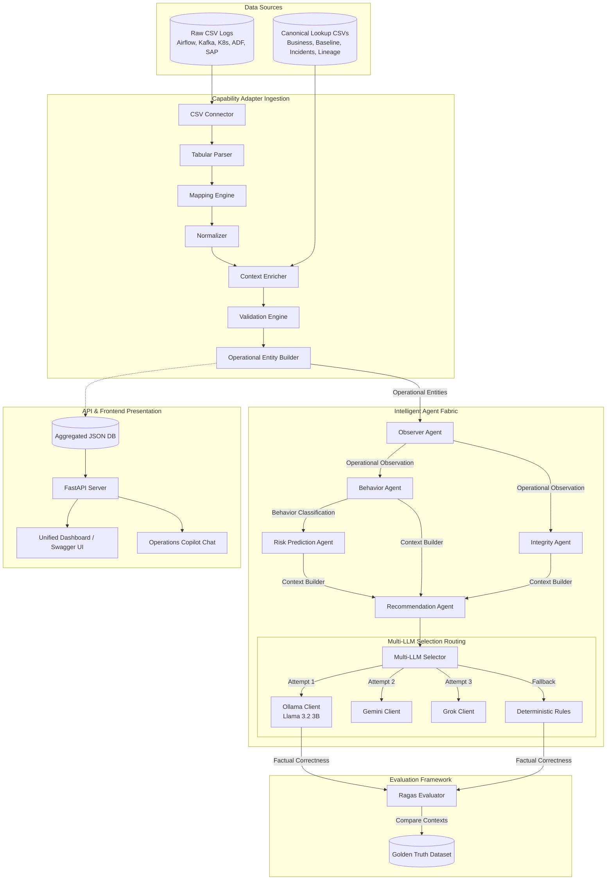
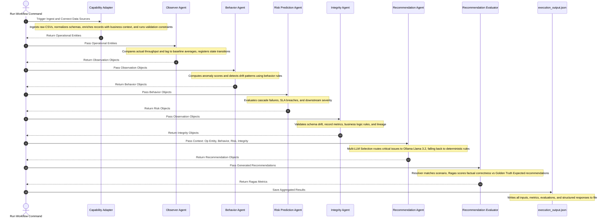

# Data Pipeline Operations Intelligence

> [!IMPORTANT]
> All examples, metrics, and workflows documented in this file represent actual structures and outputs captured from the running backend. This documentation is intended for mentors, frontend developers, and backend engineers collaborating on integration and deployment.

---

## Project Overview

### Business Problem
Modern enterprises deploy data pipelines across a fragmented ecosystem of platforms (such as Apache Airflow, Kafka streams, Kubernetes workers, Azure Data Factory, and SAP ERP jobs). Monitoring these pipelines presents significant challenges:
- **Fragmentation**: Operational logs, schema definitions, and dependency structures are siloed across separate runtimes.
- **Alert Fatigue**: Raw alerts lack contextual business metadata (criticality, cost centers, SLAs) and historical context (incident resolution history).
- **Reactive Resolution**: Operations teams respond manually to failures rather than predicting risks of cascading downstream impacts.

### Project Objective
The **Data Pipeline Operations Intelligence** platform provides a centralized, context-enriched intelligence layer. It automates the parsing, mapping, normalization, enrichment, and validation of raw execution logs into standard **Operational Entities**. It then orchestrates a multi-agent workflow (Observer, Behavior, Risk, Integrity, and Recommendation Agents) to detect anomalies, calculate risk scores, verify data integrity, and formulate automated recovery strategies.

### Enterprise Use Case
This system is designed as an operational command center for DataOps engineers. It maps incoming technical pipeline logs directly to business processes, evaluates integrity (e.g. record count deviations, lineage constraints), assesses risks of downstream impacts, and provides operations engineers with AI-enhanced step-by-step remediation plans.

---

## Features

- **Ingestion & Capability Adapter**: Multi-platform connector and parsing subsystem that ingests raw log files and maps them to a standard schema.
- **Operational Entity Model**: A unified canonical contract that acts as the single source of truth for all pipeline logs and business contexts.
- **Observer Agent**: State and metrics analyst that computes real-time deviations from historical baselines.
- **Behavior Agent**: Pattern analyzer that identifies behavioral anomalies (e.g., drift, isolated metric spikes) and computes deviation severity.
- **Risk Prediction Agent**: Cascade risk estimator that calculates downstream business risk severity and impact probability.
- **Integrity Agent**: Validation engine that verifies record counts, schemas, business rules, and upstream/downstream lineages.
- **Recommendation Agent**: Solution orchestrator that matches scenarios and selects local/cloud LLMs to generate recovery actions.
- **Multi-LLM Selection**: Intelligent client manager that delegates requests across Ollama, Gemini, and Grok, gracefully failing back to deterministic recovery rules if LLMs are offline.
- **Recommendation Evaluation**: Grading system that matches generated recommendations against a Golden Truth scenario repository and scores factual correctness using the Ragas framework.
- **Dashboard APIs**: High-performance FastAPI endpoints providing aggregated dashboard data, timeline histories, dependency trees, and agent status metrics.
- **Operations Copilot**: Natural language interface allowing DataOps engineers to chat with execution histories and query anomaly diagnostics.
- **Unified Dashboard**: Aggregated summary model combining overall health scores, active anomalies, risk levels, and agent status counts.

---

## Solution Architecture

The following diagram illustrates the logical architecture of the Data Pipeline Operations Intelligence system, illustrating the flow of data from ingestion through agent evaluation to the API and UI delivery layers:



---

## End-to-End Workflow

The runtime pipeline executes as a sequential DAG, taking raw system states and compiling them into high-level operational intelligence:



---

## Repository Structure

The project directory is structured as follows:

```
Data-Pipeline-Operations-Intelligence/
├── adapters/                  # Capability Adapter components
│   ├── connectors/            # Ingestion connectors (e.g. CSVConnector)
│   ├── parsers/               # File type parsers (TabularParser)
│   ├── mapping/               # Schema mapping engines
│   ├── normalizer/            # Numeric and string normalizer
│   ├── enricher/              # Context consolidator (lineage, history, SLA)
│   ├── validation/            # Schema and constraint validator
│   ├── entity_builder/        # Standard Operational Entity instantiation
│   └── models/                # Datatypes and models
├── agents/                    # Intelligent Agent implementations
│   ├── base/                  # Core Agent base classes
│   ├── observer/              # Observer Agent (state/deviation monitor)
│   ├── behavior/              # Behavior Agent (drift/pattern checker)
│   ├── risk/                  # Risk Prediction Agent (impact/probability calculator)
│   ├── integrity/             # Integrity Agent (data and lineage validator)
│   ├── recommendation/        # Recommendation Agent (recovery strategies & evaluators)
│   └── multi_llm_selection/   # LLM Client Router (Ollama, Gemini, Grok)
├── api/                       # REST API Layer
│   ├── routes/                # Health, Pipeline execute, and DataOps endpoints
│   ├── schemas/               # Pydantic request and response models
│   ├── services/              # Route implementation services
│   └── main.py                # FastAPI server entrypoint
├── config/                    # Ingestion configurations and Agent rule mappings
│   ├── sources.yaml           # Ingestion source configuration
│   ├── mapping.yaml           # Ingestion schema mapping matrix
│   ├── behavior_rules.yaml    # Deviation scoring and pattern thresholds
│   ├── risk_rules.yaml        # Failure probability and downstream severity mapping
│   ├── integrity_rules.yaml   # Assertion validations (schemas, lineage, metrics)
│   └── recommendation_rules.yaml # Deterministic remediation mappings
├── data/                      # Data storage directory
│   ├── raw_sources/           # Raw pipeline execution CSVs
│   ├── canonical/             # Business context lookup CSVs
│   └── evaluation/            # Golden Truth scenario definitions
├── output/                    # Generated workflow results
│   ├── execution_metadata.json # Runtime metadata (status, time)
│   └── execution_output.json  # Comprehensive outputs of all agent layers (120MB+)
├── tests/                     # Unit and integration tests
│   ├── unit/                  # Tests for APIs, LLM selection, and evaluation
│   └── integration/           # End-to-end integration workflows
├── requirements.txt           # Package dependencies
└── verify_keys.py             # Script to verify local configurations and environment keys
```

---

## Technology Stack

| Component | Technology | Version / Specification | Purpose |
| :--- | :--- | :--- | :--- |
| **Programming Language** | Python | `3.12+` | Core development runtime |
| **Backend Web Server** | Uvicorn | `^0.22` | High-performance ASGI server runtime |
| **API Framework** | FastAPI | `^0.100` | REST API framework and OpenAPI generator |
| **Validation** | Pydantic | `v2.x` | Request/Response schema validation and parsing |
| **Testing** | pytest | `^7.x` | Automated test suite execution framework |
| **Configuration** | YAML (PyYAML) | `^6.x` | Mapping, normalizer, and agent rule configuration |
| **Logging** | loguru | `^0.7` | Standardized internal logs |
| **Data Processing** | Pandas / Openpyxl | `^2.x` | CSV parser and tabular metric analyzer |
| **LLM Orchestration** | LangChain | `^0.1` | Prompt templating and LLM orchestration |
| **Model Runtime** | Ollama | Local host (`11434`) | Running Llama 3.2 3B model locally |
| **Evaluation Framework** | Ragas | Dynamic import | Objective grading of recommendation accuracy |
| **Documentation** | Swagger / OpenAPI | `3.1.0` | In-browser interactive documentation |

---

## AI Models Used

| Purpose | Model | Framework | Where Used |
| :--- | :--- | :--- | :--- |
| **Enhanced Recommendation** | `Llama 3.2 (3B)` | Ollama (Local) | Generated inside `RecommendationAgent` via `OllamaClient` |
| **Cloud Escalation** | `Gemini 1.5 Flash` | Google GenAI | Configured fallback in `MultiLLMSelectionAgent` |
| **Alternative cloud LLM** | `Grok` | xAI Provider API | Configured fallback in `MultiLLMSelectionAgent` |
| **Objective Grading** | `Llama 3.2 (3B)` | Ragas / LangChain | Calculated correctness inside `RagasEvaluator` |

---

## Frameworks & Libraries

- **FastAPI**: Provides path-operation declaration, automated OpenAPI documentation generation, and native async handlers.
- **LangChain**: Abstracts LLM interactions. Simplifies parsing structured output through Pydantic objects.
- **Ragas**: Generates factual correctness evaluations using local LLM inference engines.
- **Pandas**: Manages lookups, baselines, and execution joins. Ensures memory-efficient column mapping.

---

## Capability Adapter

### Purpose
The **Capability Adapter** serves as the system's ingestion gateway. It connects to diverse, raw log data and transforms unstructured or platform-specific variables into standardized records enriched with enterprise contexts.

```
Raw Platform CSVs (Airflow, Kafka, ADF, SAP, etc.)
  + Historical baselines, Incidents, Lineage, Business Context CSVs
                         ↓ (Ingested & Parsed)
                   Mapping Engine
                         ↓ (Columns Renamed & Unified)
                     Normalizer
                         ↓ (Standard Units & Datatypes)
                  Context Enricher
                         ↓ (Consolidated Context Metadata Joined)
                 Validation Engine
                         ↓ (Quality Constraints Verified)
            Operational Entity Builder
                         ↓
             [Standard Operational Entity]
```

### Responsibilities
1. **Source Connection**: Interacts with local databases or file logs using configuring files.
2. **Parsing**: Validates file types and reads records into standard tabular data structures.
3. **Field Mapping**: Renames platform columns (e.g. `DAG_ID` in Airflow, `TOPIC` in Kafka) to system variables.
4. **Data Normalization**: Translates raw execution strings and variables into standard statuses (e.g., standardizing `Success`, `UP`, and `active` to `SUCCESS` or `RUNNING`).
5. **Context Consolidation**: Appends critical business parameters, historical baselines, dependency counts, and previous incidents to each running instance.
6. **Data Validation**: Checks values against configuration constraints.

### Inputs & Outputs
- **Input**:
  - Raw platform execution logs (CSV files in `data/raw_sources/`).
  - Canonical lookups (business context, historical baselines, incident history, pipeline lineage, and recommendation history in `data/canonical/`).
- **Output**: 
  - Standardized JSON `Operational Entities` partitioned by dataset name.

### Normalization, Validation, and Enrichment Flow
1. **Normalization**: The normalizer formats data structures, ensuring timestamps follow ISO standards and statuses match state enums.
2. **Validation**: The validation engine evaluates constraints. If records fail (e.g., missing pipeline ID), the validation flags the entity as invalid with error descriptions.
3. **Enrichment**: The consolidator matches records against lookup databases by `pipeline_id` to join Owner, Criticality, average CPU usage, SLA thresholds, and downstream dependency counts.
4. **Operational Entity Creation**: The builder binds these parts into a unified model, computing a validation score.

- **Configuration Files Used**: [sources.yaml](file:///c:/Users/Asus/OneDrive/Documents/Desktop/Data-Pipeline-Operations-Intelligence/config/sources.yaml), [mapping.yaml](file:///c:/Users/Asus/OneDrive/Documents/Desktop/Data-Pipeline-Operations-Intelligence/config/mapping.yaml)

---

## Operational Entity Model

### Purpose
Standardizes logs from disparate platforms (e.g. Kafka stream lags, Kubernetes pod crashes, SAP ERP job batches) under a single database contract, ensuring downstream agents write platform-agnostic evaluation rules.

### Structure
The model is structured as a nested JSON object:
```json
{
  "entity_id": "Unique pipeline identifier (e.g., BRO0001)",
  "entity_name": "Human readable name of the pipeline",
  "entity_type": "Platform abstraction type (Stream, Job, Batch)",
  "source_system": "Originating runtime platform (Kafka, Airflow, SAP ERP)",
  "execution_status": "Normalized status (SUCCESS, FAILED, RUNNING, CANCELLED, QUEUED)",
  "event_timestamp": "ISO timestamp of the execution run",
  "attributes": {
    "platform_metrics": "Metrics like offset, partition, throughput, or CPU load"
  },
  "context": {
    "business_context": { "owner": "Name", "criticality": "High", "sla_minutes": 5 },
    "historical_context": { "avg_runtime_sec": 30, "success_rate": 96.39 },
    "incident_context": { "total_incidents": 9, "root_cause": "Crash" },
    "lineage_context": { "depends_on": "DAG0093", "downstream": "BRO0777" },
    "recommendation_context": { "recommendation": "Scale cluster", "applied": "Yes" }
  },
  "validation": {
    "validation_score": 100,
    "is_valid": true,
    "errors": [],
    "warnings": []
  },
  "metadata": {
    "adapter_version": "1.0",
    "pipeline_stage": "Capability Adapter",
    "generated_at": "ISO-Timestamp"
  }
}
```

### Flow
Diverse Raw Logs -> Mapping Engine -> Normalizer -> Context Enricher -> Validation -> Unified Entity

### Why it is Required
Without this unified structure, downstream agents would have to contain platform-specific parse branches, leading to code duplication. The operational entity model decouples data ingestion from intelligent analysis.

---

## Agent Architecture

### 1. Observer Agent
- **Purpose**: Evaluates current pipeline run parameters and registers anomalies or deviations.
- **Responsibilities**: Extracts throughput, lags, and execution runtimes; compares them to historical baselines; tracks trend directions.
- **Input**: Standard Operational Entity.
- **Output**: Observation Object.
- **Processing Logic**: Evaluates metrics against baseline distributions (e.g. actual throughput vs baseline average). Flags deviations exceeding thresholds as warning/critical.
- **Tech Stack & Frameworks**: Python, Pandas.
- **Configuration**: Dynamically reads baseline values from the entity context.
- **Example Output**: [See Observation Object schema in API Documentation](file:///c:/Users/Asus/OneDrive/Documents/Desktop/Data-Pipeline-Operations-Intelligence/api/API_DOCUMENTATION.md#dashboard-api)
- **Interaction with Next Agent**: Feeds directly into the Behavior Agent and the Integrity Agent.

### 2. Behavior Agent
- **Purpose**: Identifies behavior profiles and pattern anomalies over time.
- **Responsibilities**: Computes behavioral scores, classifies patterns (e.g., Isolated Metric Anomaly, Drift Detected), and determines behavior severity.
- **Input**: Observation Object.
- **Output**: Behavior Object.
- **Processing Logic**: Scores entities from 0-100 by penalizing baseline warnings/critical deviations using thresholds configured in `behavior_rules.yaml`.
- **Tech Stack & Frameworks**: Python, PyYAML, loguru.
- **Configuration**: [behavior_rules.yaml](file:///c:/Users/Asus/OneDrive/Documents/Desktop/Data-Pipeline-Operations-Intelligence/config/behavior_rules.yaml)
- **Example Output**: [See Behavior Object schema in API Documentation](file:///c:/Users/Asus/OneDrive/Documents/Desktop/Data-Pipeline-Operations-Intelligence/api/API_DOCUMENTATION.md#dashboard-api)
- **Interaction with Next Agent**: Sends calculated behavior metrics to the Risk Prediction Agent.

### 3. Risk Prediction Agent
- **Purpose**: Evaluates business-level risks of execution and metrics anomalies.
- **Responsibilities**: Evaluates cascade failure risk, determines breach probability, classifies severity, and selects risk category.
- **Input**: Behavior Object.
- **Output**: Risk Object.
- **Processing Logic**: Evaluates behavioral state vs rule matrices mapping pipeline criticality and dependency counts to final failure risks.
- **Tech Stack & Frameworks**: Python, PyYAML.
- **Configuration**: [risk_rules.yaml](file:///c:/Users/Asus/OneDrive/Documents/Desktop/Data-Pipeline-Operations-Intelligence/config/risk_rules.yaml)
- **Example Output**: [See Risk Object schema in API Documentation](file:///c:/Users/Asus/OneDrive/Documents/Desktop/Data-Pipeline-Operations-Intelligence/api/API_DOCUMENTATION.md#dashboard-api)
- **Interaction with Next Agent**: Risk parameters are used by the Recommendation Agent context builder.

### 4. Integrity Agent
- **Purpose**: Assesses trust levels of pipeline outputs.
- **Responsibilities**: Runs assertion suites for schema drifts, lineage mapping, record volume, and business rules, generating a unified trust score.
- **Input**: Observation Object.
- **Output**: Integrity Object.
- **Processing Logic**: Evaluates specific assertions (such as checking if fields match expected definitions, or verifying record counts align with expectations).
- **Tech Stack & Frameworks**: Python, PyYAML.
- **Configuration**: [integrity_rules.yaml](file:///c:/Users/Asus/OneDrive/Documents/Desktop/Data-Pipeline-Operations-Intelligence/config/integrity_rules.yaml)
- **Example Output**: [See Integrity Object schema in API Documentation](file:///c:/Users/Asus/OneDrive/Documents/Desktop/Data-Pipeline-Operations-Intelligence/api/API_DOCUMENTATION.md#dashboard-api)
- **Interaction with Next Agent**: Integrity objects are consumed by the Recommendation Agent.

### 5. Recommendation Agent
- **Purpose**: Orchestrates optimal recovery actions.
- **Responsibilities**: Builds recommendation contexts, matches scenario patterns, coordinates LLM generation order, and calculates execution confidence.
- **Input**: Behavior, Risk, Integrity, and Operational Entity objects.
- **Output**: Recommendation Object.
- **Processing Logic**: Utilizes `RecommendationContextBuilder` to compile agent results. First, it identifies base rules via `recommendation_rules.yaml`. If priority is CRITICAL or HIGH, it uses `MultiLLMSelectionAgent` to call local Ollama (Llama 3.2 3B model). If Ollama fails, it rolls back to rule-based actions.
- **Tech Stack & Frameworks**: Python, PyYAML, LangChain, Ollama client.
- **Configuration**: [recommendation_rules.yaml](file:///c:/Users/Asus/OneDrive/Documents/Desktop/Data-Pipeline-Operations-Intelligence/config/recommendation_rules.yaml)
- **Example Output**: [See Recommendation Object schema in API Documentation](file:///c:/Users/Asus/OneDrive/Documents/Desktop/Data-Pipeline-Operations-Intelligence/api/API_DOCUMENTATION.md#dashboard-api)
- **Interaction with Next Agent**: The output recommendation is evaluated by the Recommendation Evaluator.

---

## Recommendation Evaluation

The system integrates an automated validation layer to grade generated recovery actions:

```
[Recommendation Object]
        ↓
  Context Builder
        ↓ (Consolidated Context Properties)
  Scenario Resolver ─── reads ───► Golden Truth Dataset (golden_truth_recommendations.json)
        ↓ (Best-Matched Golden Scenario Resolved)
  Ragas Evaluator (Checks Factual Correctness using local Ollama model)
        ↓
  [Graded Evaluation Output] (Score + status)
```

- **Golden Truth Dataset**: A curated file `data/evaluation/golden_truth_recommendations.json` containing 400+ scenario matrices with pre-defined correct recommendations.
- **Scenario Resolver**: Reads pipeline attributes (platform, status, severity, risk) and computes a specificity score. It resolved the best-matching golden scenario for comparison.
- **Matching Logic**: Uses case-insensitive scoring. Scenarios matching more keys (e.g. matching platform, status, and severity) are prioritized over generic matches.
- **RAGAS Evaluation**: Uses the Factual Correctness metric, prompting the local Ollama LLM to compare the semantics of the generated recommendation vs the expected golden recommendation.
- **Current Flow**: If a scenario matches, it calls Ragas to score semantic correctness (0.0 to 1.0) and sets evaluation status to `COMPLETED`.
- **Current Limitations**: Requires local Ollama running. If Ollama or Ragas are missing/offline, it falls back to setting evaluation status to `UNAVAILABLE` with an empty score.
- **Future Improvements**: Add faithfulness and answer relevancy metrics; introduce managed cloud LLMs (Gemini/Grok) as evaluation engines.

---

## REST APIs

The FastAPI server provides endpoints for dashboard data, pipeline executions, and copilot diagnostics. A complete payload reference is available in [api/API_DOCUMENTATION.md](file:///c:/Users/Asus/OneDrive/Documents/Desktop/Data-Pipeline-Operations-Intelligence/api/API_DOCUMENTATION.md).

| Method | Endpoint | Description | Status Codes |
| :--- | :--- | :--- | :--- |
| **GET** | `/health` | Server health and service details | `200 OK` |
| **POST** | `/pipeline/execute` | Triggers the complete pipeline workflow run | `200 OK` |
| **POST** | `/api/v1/dataops/execute` | Triggers the DataOps workflow run | `200 OK` |
| **GET** | `/api/v1/dataops/dashboard` | Aggregated metrics, anomalies, and agent details | `200 OK` |
| **GET** | `/api/v1/dataops/pipelines/{pipelineId}` | Operational, observation, risk, behavior, and integrity data | `200 OK`, `422 Unprocessable Entity` |
| **GET** | `/api/v1/dataops/pipelines/{pipelineId}/timeline` | Historical execution status and metrics timeline | `200 OK`, `422 Unprocessable Entity` |
| **GET** | `/api/v1/dataops/pipelines/{pipelineId}/dependencies` | Upstream/downstream pipeline dependency lineage mapping | `200 OK`, `422 Unprocessable Entity` |
| **GET** | `/api/v1/dataops/recommendations/{pipelineId}` | Generated recommendation and evaluation score details | `200 OK`, `422 Unprocessable Entity` |
| **POST** | `/api/v1/dataops/copilot/chat` | Operations Copilot natural language chat interface | `200 OK`, `422 Unprocessable Entity` |
| **GET** | `/api/v1/dataops/agents` | Status, version, and metrics for all AIF agents | `200 OK` |

---

## Terminal Execution Flow

Executing the workflow outputs logging and progress details sequentially:

1. **Capability Adapter Ingests Sources**:
   ```
   Capability Adapter: Reading raw and business context sources...
   Capability Adapter Completed Successfully.
   ```
2. **Observer Agent Runs state/deviation Checks**:
   ```
   Observer Agent: Evaluating pipeline execution state and deviations...
   Observer Agent Completed Successfully.
   ```
3. **Behavior Agent Checks Deviation Rules**:
   ```
   Behavior Agent: Running baseline deviation and drift analysis...
   Behavior Agent Completed Successfully.
   ```
4. **Risk Prediction Agent Calculates Risks**:
   ```
   Risk Prediction Agent: Evaluating business risks and probability...
   Risk Prediction Agent Completed Successfully.
   ```
5. **Integrity Agent Runs Schema Assertions**:
   ```
   Integrity Agent: Validating schemas, lineage, and business rules...
   Integrity Agent Completed Successfully.
   ```
6. **Recommendation Agent Generates Solutions**:
   ```
   Recommendation Agent: Formulating optimal response strategies...
   
   Recommendation Agent
   --------------------------------
   Priority : HIGH
   Provider : Ollama (Llama 3.2 3B)
   Generating recommendation...
   ✓ Recommendation generated successfully
   Recommendation Object Generated Successfully.
   Recommendation Agent Completed Successfully.
   ```
7. **Recommendation Evaluator Grades Output**:
   ```
   ==================================================
                 Recommendation Evaluation
   ==================================================
   Pipeline ID             : BRO0001
   Golden Truth Scenario   : Kafka High Lag Deviation
   Evaluation Engine       : RAGAS
   Metric                  : factual_correctness
   Status                  : COMPLETED
   Score                   : 0.95
   ==================================================
   ```
8. **Execution Summary Prints Final Stats**:
   ```
   ==================================================
                 FINAL EXECUTION SUMMARY
   ==================================================
   Pipeline Processing:
     Operational Entities        : 7000
     Observation Objects         : 7000
     Behavior Objects            : 7000
     Risk Objects                : 7000
     Integrity Objects           : 7000
     Recommendation Objects      : 7000
   --------------------------------------------------
   Recommendation Engine:
     LLM Generated               : 1
     Deterministic               : 6999
   --------------------------------------------------
   Evaluation:
     Golden Truth Matched        : 3349
     Golden Truth Unmatched      : 3651
     Representative Eval Status  : COMPLETED
   --------------------------------------------------
   Execution:
     Execution Time              : 106.63 seconds
     Output File                 : output/execution_output.json
     Execution Status            : SUCCESS
   ==================================================
   ```

---

## Installation Guide

### Prerequisites
- Python `3.12` or higher installed.
- Git.
- At least 8GB RAM (recommended for running local Ollama inference models).

### Create Virtual Environment
Run the following commands in the project directory:
```powershell
# Create python virtual environment
python -m venv .venv

# Activate virtual environment
.venv\Scripts\Activate.ps1
```

### Install Dependencies
```powershell
pip install -r requirements.txt
```

### Install Ollama
1. Download Ollama from the [Ollama Official Website](https://ollama.com/).
2. Complete the installation wizard on your machine.

### Download Model
Start Ollama and pull the Llama 3.2 3B parameter model:
```powershell
ollama pull llama3.2:3b
```

---

## Running the Project

### Run Workflow
Execute the end-to-end processing pipeline, which will parse CSV datasets, run all agent evaluations, generate recommendations, score them using Ragas, and output the data to the `output/` directory:
```powershell
python -m workflows.main
```

### Run API Server
Start the local FastAPI development server on port 8000:
```powershell
uvicorn api.main:app --host 127.0.0.1 --port 8000 --reload
```

### Run Tests
Execute the unit and API verification test suite:
```powershell
pytest
```

### Open Swagger
Once the server is running, navigate your web browser to:
- Interactive Swagger UI: [http://localhost:8000/docs](http://localhost:8000/docs)
- OpenAPI JSON Schema: [http://localhost:8000/openapi.json](http://localhost:8000/openapi.json)

---

## Project Outputs

- **[execution_output.json](file:///c:/Users/Asus/OneDrive/Documents/Desktop/Data-Pipeline-Operations-Intelligence/output/execution_output.json)**: The master output database containing granular JSON properties of all normalized logs, parsed columns, mappings, baseline observations, behavioral drifts, computed risk scores, data integrity results, and generated recommendations.
- **[execution_metadata.json](file:///c:/Users/Asus/OneDrive/Documents/Desktop/Data-Pipeline-Operations-Intelligence/output/execution_metadata.json)**: High-level workflow metadata showing execution times and exit statuses (e.g. `SUCCESS`).
- **REST API Responses**: Accessible dynamically through Swagger UI.
- **Dashboard Data**: Consolidated structures for frontend metrics charts and list tables.
- **Recommendation Evaluation Output**: Scores generated via Ragas, matching individual runs to the golden truth scenarios.

---

## Testing

The testing suite ensures the reliability of the system through targeted unit tests:
- **`test_dashboard_api.py`**: Validates FastAPI path operations and response payload formatting.
- **`test_multi_llm_selection.py`**: Verifies that the client fallback and exception handling logic successfully absorbs errors and delegates to deterministic algorithms.
- **`test_recommendation_evaluation.py`**: Tests scenario matching, case insensitivity, specificity checks, and RAGAS evaluations.

---

## Screenshots

> [!NOTE]
> The screenshots below correspond to the visual assets and UI modules for developers and reviewers:

### 1. Solution Architecture Block Diagram


### 2. Terminal End-to-End Execution Flow


### 3. FastAPI Swagger UI Documentation


### 4. Operations Unified Dashboard UI


### 5. AI Recommendation Output Panel


### 6. RAGAS Correctness Evaluation Score Panel


---

## Future Scope

- **Managed Cloud LLM Grading**: Support Gemini 1.5 Pro and Grok clients directly for evaluating recommendations, bypassing local Ollama resource requirements.
- **Active Data Lineage Graphs**: Integrate live Mermaid lineage diagrams dynamically via the `/dependencies` API endpoint.
- **Automated Workflow Execution Hooking**: Implement webhooks in Airflow or Kafka connect to execute this intelligence pipeline automatically upon state changes.
- **Incremental Data Partitioning**: Optimize tabular connectors to parse incremental stream windows, supporting near-real-time streaming inputs rather than static CSV batches.

---

## Contributors

- **Adaptive Intelligence Fabric Core Engineering Team**
- **DataOps Intelligence Contributors**
